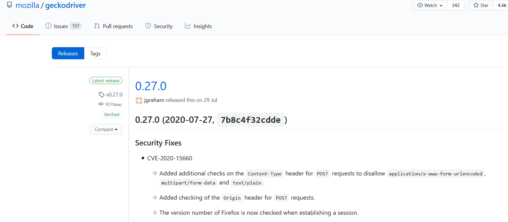
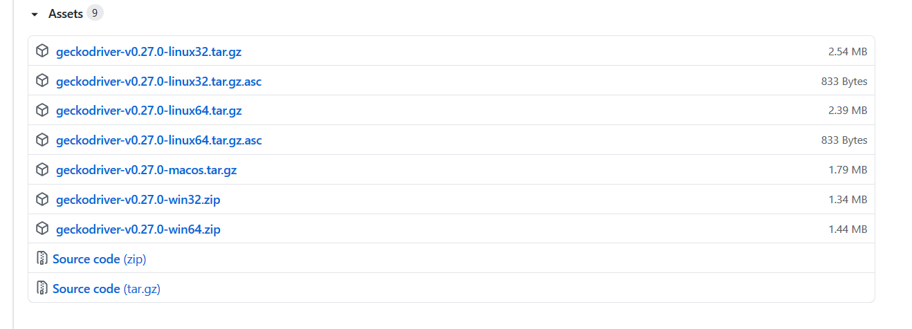
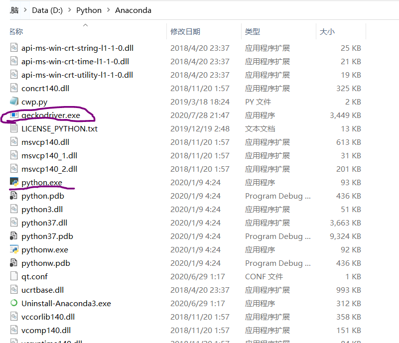
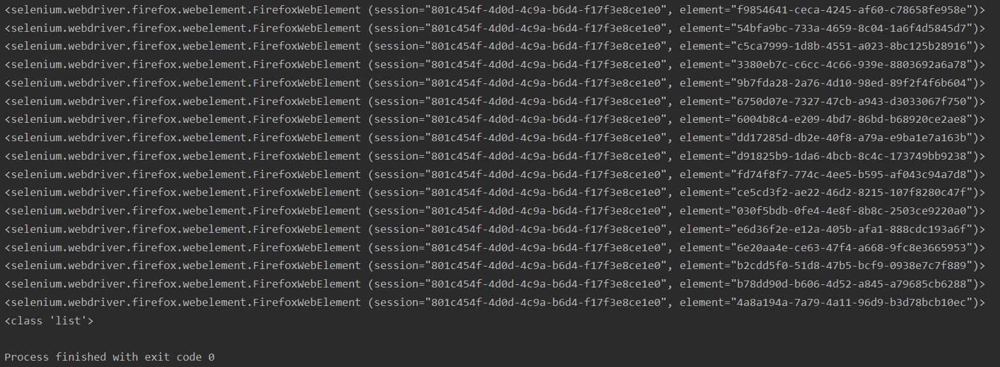

---
title: Selenium运行错误的解决方法
date: 2020-10-12 21:00:57
summary: 本文分享一些Selenium常见运行错误的解决方法。
tags:
- Python
- Selenium
- 异常修复
categories:
- Python
---

# selenium.common.exceptions.WebDriverException: Message: 'geckodriver' executable needs to be in PATH

安装selenium的话，使用pip即可：`pip install selenium`

但是安装成功后运行会报错：<font color="red">selenium.common.exceptions.WebDriverException: Message: 'geckodriver' executable needs to be in PATH.</font>

主要原因可能是没有安装对应的浏览器驱动程序。

我常使用Firefox，其对应驱动的Github地址[在这里](https://github.com/mozilla/geckodriver/releases)：


选择合适的压缩包下载即可：


打开win64压缩包，里面有一个exe文件。将此exe文件copy到python.exe的目录下：


然后重新运行你的程序，一般来说可以不报这个错误了！

# TypeError: 'FirefoxWebElement' object is not iterable

请看下面的代码：

```python
from selenium import webdriver

driver = webdriver.Firefox()
driver.maximize_window()
driver.implicitly_wait(50)
driver.get("http://www.baidu.com")
tag_names = driver.find_element_by_tag_name('input')
for tag_name in tag_names:
    print(tag_name)
print(type(tag_names))
driver.quit()
```

运行时报错：

<font color="red">TypeError: 'FirefoxWebElement' object is not iterable</font>

错误原因是：错误地使用了API，实际上应该是find_element<font color="red">s</font>_by_tag_name

没加s的话只是定位了单个元素，而加上s可以定义多个元素，才能返回可迭代的list对象！

运行结果示意：

