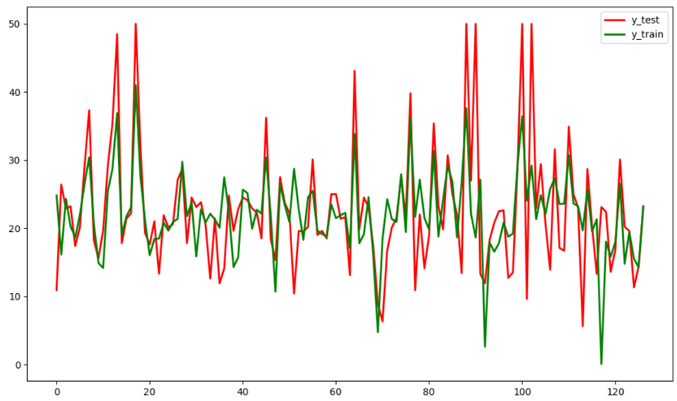

---
title: Sklearn线性回归模型预测波士顿房价
date: 2020-02-27 11:56:02
summary: 本文分享Sklearn线性回归模型预测波士顿房价的过程。
tags:
- Python
- Scikit-Learn
- Matplotlib
categories:
- Python
---

# 波士顿房价

这是 sklearn.datasets 里的一种 Toy Dataset ，包含503个美国波士顿房价的观测值，是内置的小数据集，也是研究回归算法的优秀数据集。

# Python编程实现

```python
import matplotlib.pyplot as plt
import matplotlib.font_manager as fm
import numpy as np
import pandas as pd
from sklearn.datasets import load_boston
from sklearn.model_selection import train_test_split
from sklearn.linear_model import LinearRegression
from sklearn import metrics
from sklearn.metrics import r2_score


# 从读取的房价数据存储在boston变量中
boston = load_boston()

# 打印boston包含的内容
print(boston.keys())

# 打印data的变量名
print(boston.feature_names)

# 将data转换为DataFrame格式以方便显示
bos = pd.DataFrame(boston.data)
# data的第6列数据为RM
print(bos[5].head())

# 将data转换为DataFrame格式以方便显示
bos_target = pd.DataFrame(boston.target)
print(bos_target.head())

# 选取data中的RM变量
x = bos.iloc[:, 5:6]
# 设定target为y
y = bos_target
# 定义自定义字体，文件名是系统中文字体
myfont = fm.FontProperties(fname='C:/Windows/Fonts/msyh.ttc')
plt.scatter(x, y)
# x轴标签设定文字为中文msyh格式
plt.xlabel(u'住宅平均房间数', fontproperties=myfont)
# y轴标签设定文字为中文msyh格式
plt.ylabel(u'房地产价格', fontproperties=myfont)
# 标题
plt.title(u'RM与MEDV的关系', fontproperties=myfont)
plt.show()

# 把x、y转化为数组形式，便于计算
x = np.array(x.values)
y = np.array(y.values)
# 以25%的数据构建测试样本，剩余作为训练样本
x_train, x_test, y_train, y_test = train_test_split(x, y, test_size=0.25)
print(x_train.shape, x_test.shape, y_train.shape, y_test.shape)

# 设定回归算法
lr = LinearRegression()
# 使用训练数据进行参数求解
lr.fit(x_train, y_train)
# LinearRegression(copy_X=True, fit_intercept=True, n_jobs=1, normalize=False)
print('求解系数为：', lr.intercept_)
print('求解系数为：', lr.coef_)

# 对测试集的预测
y_hat = lr.predict(x_test)
# 打印前10个预测值
y_hat[0:9]
# y_test与y_hat的可视化
# 设置图片尺寸
plt.figure(figsize=(10, 6))
# 创建t变量
t = np.arange(len(x_test))
# 绘制y_test曲线
plt.plot(t, y_test, 'r', linewidth=2, label='y_test')
# 绘制y_hat曲线
plt.plot(t, y_hat, 'g', linewidth=2, label='y_train')
# 设置图例
plt.legend()
plt.show()

# 拟合优度R2的输出方法1
print("r2:", lr.score(x_test, y_test))

# 拟合优度R2的输出方法2
print("r2_score:", r2_score(x_test, y_hat))

# 用Scikit_learn计算MAE
print("MAE:", metrics.mean_absolute_error(y_test, y_hat))

# 用Scikit_learn计算MSE
print("MSE:", metrics.mean_squared_error(y_test, y_hat))

# 用Scikit_learn计算RMSE
print("RMSE:", np.sqrt(metrics.mean_squared_error(y_test, y_hat)))
```

# 绘图



# 输出

```python
dict_keys(['data', 'target', 'feature_names', 'DESCR', 'filename'])
['CRIM' 'ZN' 'INDUS' 'CHAS' 'NOX' 'RM' 'AGE' 'DIS' 'RAD' 'TAX' 'PTRATIO'
 'B' 'LSTAT']
0    6.575
1    6.421
2    7.185
3    6.998
4    7.147
Name: 5, dtype: float64
      0
0  24.0
1  21.6
2  34.7
3  33.4
4  36.2
(379, 1) (127, 1) (379, 1) (127, 1)
求解系数为： [-35.59828349]
求解系数为： [[9.23195448]]
r2: 0.3944946886803493
r2_score: -660.1580577546584
MAE: 4.733243417768924
MSE: 48.43066789457248
RMSE: 6.959214603284805
```
