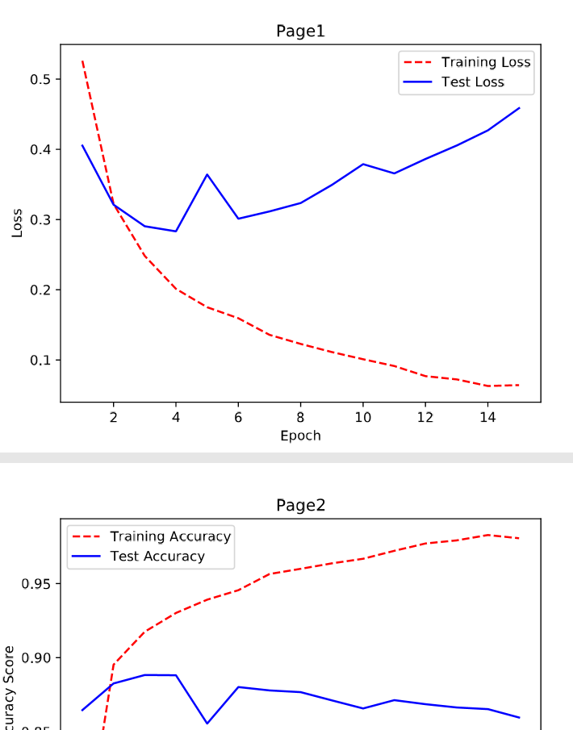
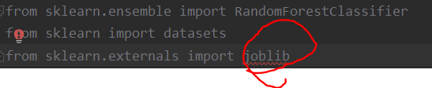
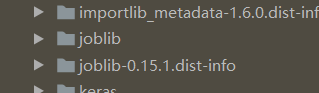

---
title: Sklearn运行错误的解决方法
date: 2020-09-26 19:16:47
summary: 本文分享一些Scikit-Learn常见运行错误的解决方法。
tags:
- Python
- Scikit-Learn
- 异常修复
categories:
- Python
---

# FutureWarning: Pass threshold=18 as keyword args

```
FutureWarning: Pass threshold=18 as keyword args. From version 0.25 passing these as positional arguments will result in an error
  FutureWarning)
```

看了看代码，问题应该是这里：

```python
# 创建二值化器
binarizer = Binarizer(18)
```

追着去看了看<code>sklearn\utils\validation.py:71</code>，基本确定了是应该这么写：

```python
# 创建二值化器
binarizer = Binarizer(threshold=18)
```

# ConvergenceWarning: lbfgs failed to converge (status=1):STOP: ...

尝试逻辑回归时，遇到如下错误：

```
D:\PyCharm\machine_learning_py_codes\venv\lib\site-packages\sklearn\linear_model\_logistic.py:764: ConvergenceWarning: lbfgs failed to converge (status=1):
STOP: TOTAL NO. of ITERATIONS REACHED LIMIT.
```

```
Increase the number of iterations (max_iter) or scale the data as shown in:
		https://scikit-learn.org/stable/modules/preprocessing.html
Please also refer to the documentation for alternative solver options:
		https://scikit-learn.org/stable/modules/linear_model.html#logistic-regression
	extra_warning_msg=_LOGISTIC_SOLVER_CONVERGENCE_MSG)
D:\PyCharm\machine_learning_py_codes\venv\lib\site-packages\sklearn\linear_model\_logistic.py:764: ConvergenceWarning: lbfgs failed to converge (status=1):
STOP: TOTAL NO. of ITERATIONS REACHED LIMIT.
```

```
Increase the number of iterations (max_iter) or scale the data as shown in:
		https://scikit-learn.org/stable/modules/preprocessing.html
Please also refer to the documentation for alternative solver options:
		https://scikit-learn.org/stable/modules/linear_model.html#logistic-regression
	extra_warning_msg=_LOGISTIC_SOLVER_CONVERGENCE_MSG)
```

```
D:\PyCharm\machine_learning_py_codes\venv\lib\site-packages\sklearn\linear_model\_logistic.py:764: ConvergenceWarning: lbfgs failed to converge (status=1):
STOP: TOTAL NO. of ITERATIONS REACHED LIMIT.
```

```
Increase the number of iterations (max_iter) or scale the data as shown in:
		https://scikit-learn.org/stable/modules/preprocessing.html
Please also refer to the documentation for alternative solver options:
		https://scikit-learn.org/stable/modules/linear_model.html#logistic-regression
	extra_warning_msg=_LOGISTIC_SOLVER_CONVERGENCE_MSG)
D:\PyCharm\machine_learning_py_codes\venv\lib\site-packages\sklearn\linear_model\_logistic.py:764: ConvergenceWarning: lbfgs failed to converge (status=1):
STOP: TOTAL NO. of ITERATIONS REACHED LIMIT.
```

```
Increase the number of iterations (max_iter) or scale the data as shown in:
		https://scikit-learn.org/stable/modules/preprocessing.html
Please also refer to the documentation for alternative solver options:
		https://scikit-learn.org/stable/modules/linear_model.html#logistic-regression
	extra_warning_msg=_LOGISTIC_SOLVER_CONVERGENCE_MSG)
```

看异常栈，反复出现 max_iter，问题就在于我写的是`logit = LogisticRegression()`，应该改成`logit = LogisticRegression(max_iter=10000)`，这样就OK了。

# ConvergenceWarning: Maximum number of iterations 200 reached. Increase it to improve convergence

学习机器学习遇到报错：
<font color="red">ConvergenceWarning: Maximum number of iterations 200 reached. Increase it to improve convergence.
" improve convergence." % max_iter, ConvergenceWarning)</font>

```python
nmf = NMF(n_components=10, random_state=1)
```

问题是迭代了200次但是还是没达到最佳拟合，需要在创建NMF的时候加一下`max_iter=10000`

```python
nmf = NMF(n_components=10, random_state=1, max_iter=10000)
```

# train_acc=hist.history['acc'] KeyError: 'acc'

可视化神经网络训练过程时处理报错：
<font color="red">train_acc=hist.history['acc']
KeyError: 'acc'</font>

回看编译神经网络的时候，是这样写的：

```python
network.compile(loss="binary_crossentropy", optimizer="rmsprop", metrics=["accuracy"])
```

但绘图是这样写的：

```python
fig = plt.figure()
training_accuracy = history.history["acc"]
test_accuracy = history.history["val_acc"]
plt.plot(epoch_count, training_accuracy, "r--")
plt.plot(epoch_count, test_accuracy, "b-")
plt.legend(["Training Accuracy", "Test Accuracy"])
plt.xlabel("Epoch")
plt.ylabel("Accuracy Score")
plt.title("Page2")
pdf.savefig(fig)
plt.close(fig)
plt.show()
```

尝试了一些办法，最后还是觉得问题在后面的acc上，改成accuracy，就OK了：



# joblib.externals.loky.process_executor._RemoteTraceback:PermissionError:[WinError 5] 拒绝访问

错误代码段：
```python
knn = KNeighborsClassifier(n_neighbors=5, n_jobs=-1)
```

异常栈：
<font color="red">����: �޷���ֹ PID 18696 (���� PID 22312 �ӽ���)�Ľ��̡�
ԭ��: û�д������ʵ�������С�
����: û���ҵ����� "22408"��
����: û���ҵ����� "23400"��
����: û���ҵ����� "4240"��
����: û���ҵ����� "18976"��
����: û���ҵ����� "16552"��
joblib.externals.loky.process_executor._RemoteTraceback: 
"""
Traceback (most recent call last):
	...
PermissionError: [WinError 5] 拒绝访问。
"""

<font color="red">The above exception was the direct cause of the following exception:

<font color="red">	...
joblib.externals.loky.process_executor.BrokenProcessPool: A task has failed to un-serialize. Please ensure that the arguments of the function are all picklable.</font>

我先去查了 `joblib.externals.loky.process_executor.BrokenProcessPool: A task has failed to un-serialize. Please ensure that the arguments of the function are all picklable.` 这个问题，没有任何有意义的建议。

然后找到问题开始的地方：`PermissionError: [WinError 5] 拒绝访问`，发现网上的说法更是扯远了，然后就很自闭。
照着网上的说法，修改了users权限，然后就报错[WinError6]，是在没办法。

但在写另一篇code的时候，遇到类似的问题，报错基本一致，我就思考了一下为什么会报这个错：结合之前网上查的资料，我觉得多集中在多线程和多核上，再看着WinError，我还得去改users权限，那就说明问题在OS上。
这个问题我现在也没有一个成熟的结论，但我的判断是：Python代码无权访问WindowsOS的一些核心信息？？？

那怎么处理呢？反正也只是本机的简单test，去掉多核相关n_jobs=-1，使用默认的n_jobs即可：
```python
knn = KNeighborsClassifier(n_neighbors=5)
```

# from sklearn.externals import joblib

import部分代码：



发现 缺 joblib，需要补一下安装。

安装scikit-learn的依赖包，-U表示安装最新版本：

`pip install -U joblib`
`pip install -U scikit-learn`


查看一下目录，即使用命令安装了，externals 还是没有 joblib：


但是发现还是有 joblib 的：


所以，此时 `import joblib` 即可。
