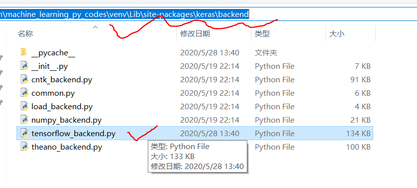
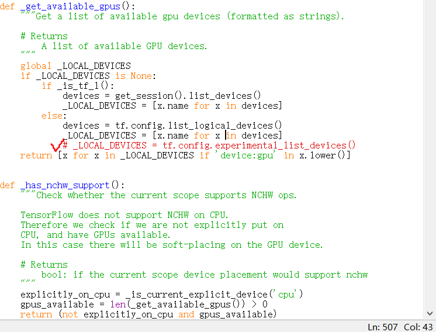
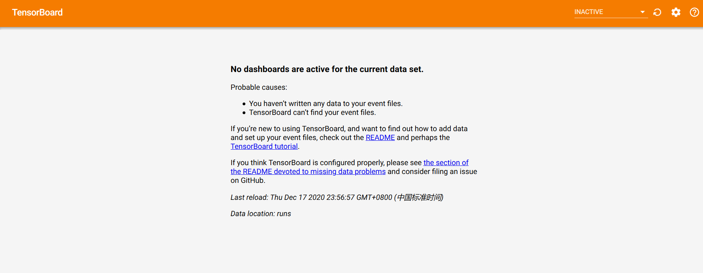
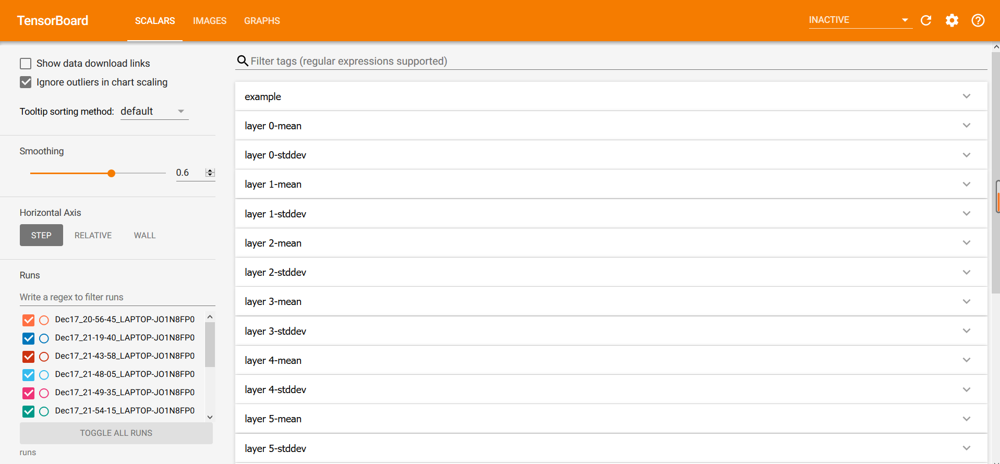
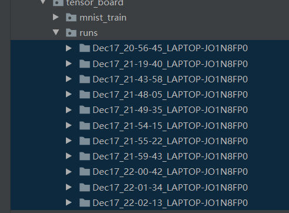
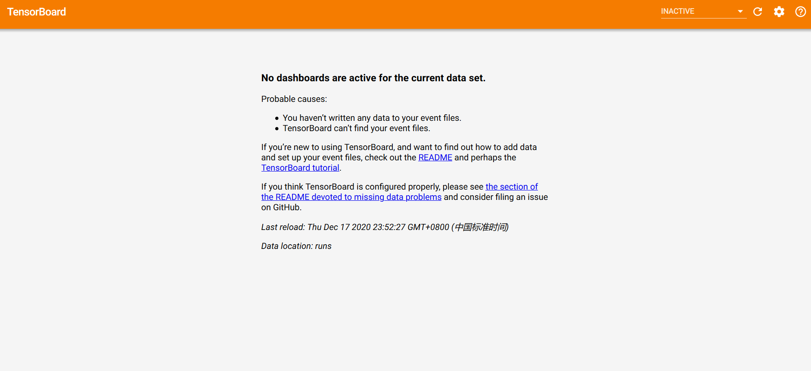

---
title: TensorFlow运行错误的解决方法
date: 2020-09-26 18:49:43
summary: 本文分享一些TensorFlow常见运行错误的解决方法。
tags:
- Python
- TensorFlow
- 异常修复
categories:
- Python
---

# module ‘tensorflow_core._api.v2.config’ has no attribute ‘experimental_list_devices’

报错：
<font color="red">module 'tensorflow_core._api.v2.config' has no attribute 'experimental_list_devices'</font>

找到图示文件：


把原506行注释，补加：

```python
devices = tf.config.list_logical_devices()
_LOCAL_DEVICES = [x.name for x in devices]
```



运行神经网络程序，解决问题。

# TensorBoard的启动问题

TensorBoard的启动是很简单的，在安装好所有的库之后，命令行输入命令`tensorboard --logdir=runs`即可启动。

但是启动以后，即便我们有所提交，页面也一直是这样的：


是哪里出了问题呢？

其实是启动路径的问题，我们应该进入py脚本的路径下运行命令，这样才能看到我们之前所想要见到的效果。

# TensorBoard已发送内容的清除

多次使用之后，TensorBoard是这样的：


很乱对吧？那我们想要去掉这些内容怎么办？

我们可以尝试清空浏览器缓存等，但发现并没有效果。

其实我们应该找到运行启动命令的目录，其中的`runs`下就是历史记录，答案就在这里：


删掉不需要的提交，重启服务，即可发现不需要的都消失了：

