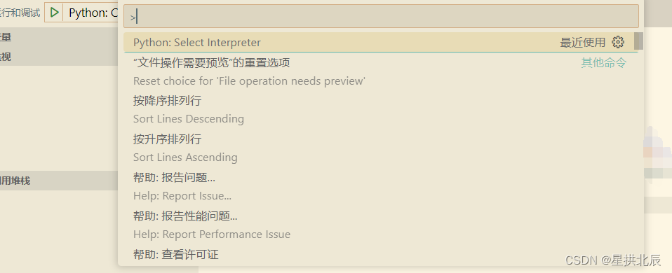

VSCode安装Python扩展插件后，可以编写和执行Python程序。

如果Python工程在远程服务器上，需要先[连接Linux服务器](https://blankspace.blog.csdn.net/article/details/127764676)，Python扩展也要在服务器上安装一份：

组合键`Ctrl+Shift+P`，会弹出输入框：

输入`Python: Select Interpreter`，选择需要的虚拟环境`python.exe`

至此，即可基于对应的虚拟环境运行Python程序。
