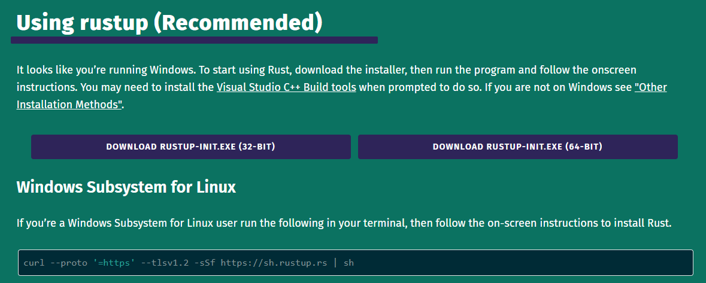

---
title: Rust的Cargo构建方法
date: 2023-01-05 17:29:33
summary: 本文分享Rust的Cargo构建方法。
tags:
- Rust
- Cargo
categories:
- 开发技术
---

# Rust学习资料

- [Rusty锈书](https://rusty.rs/about.html)
- [Rust学习笔记](https://skyao.io/learning-rust)
- [Rust语言圣经](https://course.rs/about-book.html)
- [Rust程序设计语言](https://rust.bootcss.com/title-page.html)
- [Rust语言中文精选](https://www.yuque.com/chaosbot/rust_magazine_2021)

# Rust环境搭建

[Rust官方下载地址](https://www.rust-lang.org/tools/install)



安装Rust插件的CLion和VSCode都可以借助Cargo构建Rust工程项目。

Cargo镜像配置(修改`config.toml`配置文件)：

```shell
# 只保留一个选定的镜像
# replace-with = 'ustc'
# replace-with = 'tuna'
# replace-with = 'sjtu'
# replace-with = 'rustcc'
# replace-with = 'aliyun'

# 源码地址
[source.crates-io]
registry = "https://github.com/rust-lang/crates.io-index"

# 清华大学镜像
[source.tuna]
registry = "https://mirrors.tuna.tsinghua.edu.cn/git/crates.io-index.git"

# 中国科学技术大学镜像
[source.ustc]
registry = "git://mirrors.ustc.edu.cn/crates.io-index"

# 上海交通大学镜像
[source.sjtu]
registry = "https://mirrors.sjtug.sjtu.edu.cn/git/crates.io-index"

# rustcc社区镜像
[source.rustcc]
registry = "git://crates.rustcc.cn/crates.io-index"

# 阿里云镜像
[source.aliyun]
registry = "https://code.aliyun.com/rustcc/crates.io-index"
```

Cargo创建工程：
```shell
cargo new rust-web-server
```

Cargo验证代码正确性：
```shell
cargo check
```

Cargo编译工程：
```shell
cargo build
```

Cargo运行工程：
```shell
cargo run
```


考虑到Cargo构建的缓慢，可以这样配置`config.toml`：

```shell
[http]
proxy="127.0.0.1:7890"

[https]
proxy="127.0.0.1:7890"

[source.crates-io]
replace-with = 'ustc'

[source.ustc]
registry = "git://mirrors.ustc.edu.cn/crates.io-index"
```

# Rust异常处理

## failed to run custom build command for openssl-sys v0.9.39

Ubuntu环境下编译Rust程序报错：
<font color="red">failed to run custom build command for openssl-sys v0.9.39</font>

Ubuntu版本：20.04

参考[GitHub](https://github.com/sfackler/rust-openssl/issues/1021)的讨论，提供两种可能的解决方法：
1. `sudo apt install pkg-config`
2. `sudo apt install libssl-dev`

博主采用第二种方法解决此问题。

# Rust系统软件开发

在软件行业，数据库、操作系统和编译器并称为三大基础系统软件，可以说是整个计算机软件的基石。在过去，C语言是构建系统软件的主流编程语言。然而，C语言经常出现内存泄露以及指针使用的安全问题。与此同时，大量的系统软件需要高网络安全、高性能的场景，网络安全中由不正确的内存访问引起的问题占有相当突出的比例。Rust作为一门通用系统级编程语言，它可以有效的解决编程时引入内存访问问题、同时保持高性能。由于其出色的内存安全机制、不亚于C语言的性能优势等特点，近年来被认为是下一代的适合操作系统开发的编程语言。因此，可以尝试基于Rust编程语言来实现基础系统软件开发。

# Rust参考项目

- [Rust实现链表](https://github.com/rust-unofficial/too-many-lists)
- [Rust实现区块链](https://github.com/ZuoFuhong/blockchain_rust)
- [Rust实现猜数字](https://github.com/Ubpa/LearnRust/tree/main/OfficialTutorial/02_guessing_game)
- [Rust实现简易Git](https://github.com/Byron/gitoxide)
    - [版本控制原理](https://missing.csail.mit.edu/2020/version-control/)
    - [Java实现简易Git](https://sp21.datastructur.es/materials/proj/proj2/proj2)
- [Rust实现智能合约](https://paritytech.github.io/ink/)
- [Rust实现B+树](https://github.com/sjyango/b_plus_tree_by_rust)
    - [B+树可视化](https://www.cs.usfca.edu/~galles/visualization/BPlusTree.html)
- [Rust实现LRU缓存](https://leetcode.cn/problems/lru-cache/)
