---
title: VB.NET程序设计实验
date: 2021-02-01 10:13:51
summary: 本文分享两个VB.NET程序设计实验题。
tags:
- VB.NET
categories:
- VB.NET
---

# VB.NET控件综合运用

## 目的与任务

本实验主要练习VB.NET的控件的综合运用。熟悉VB.NET的集成开发环境，掌握VB.NET编程技巧和开发过程。

实验学时数：4学时

## 实验内容

某商店为了迎接“五一”将进行促销活动，促销的商品包括服装、鞋、箱包、化妆品和床上用品五类。在促销期间，每种产品的规定品牌前5件以3折特价出售，先到先得，每种特价商品每人限购1件，售完为止。（例如，张三可以同时以3折的价格购买1件“幸福羊毛衫”、1件“米奇T恤”、1双“苹果男鞋”，但是不能以3折的价格购买2件“幸福羊毛衫”）买这五类产品的促销商品列表如下表：
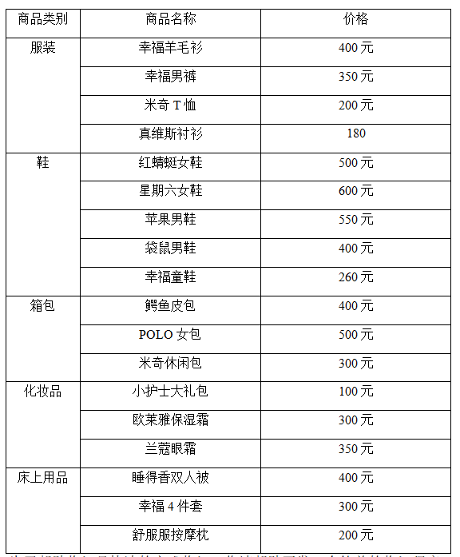

为了帮助收银员快速的完成收银工作请帮助开发一个简单的收银程序。

参考界面如下：
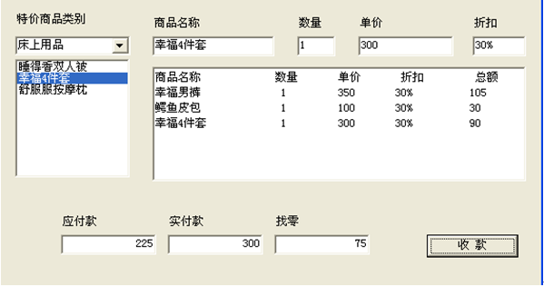

（1）基本要求：每次在列表框中点击相应的商品时，会显示商品的名称、数量、单价折扣，并把用户所采购的所有商品在文本框内进行汇总，当输入实付款后单击“收款”按钮后计算应找的零钱。   
（2）进一步要求：添加菜单，使得对于特价商品的种类、品牌商品、价格和折扣进行编辑。
（3）创新提示：无。要求自行寻找可改进的地方和创新点。

<font color="red">注意：付款金额要合理。
例如，购买41元的商品，实付款为41元、50元、100元、101元是合理的；实付款为200元，即为不合理。</font>


## 编程实现

```vbnet
Public Class Form1
    Dim counter As Integer = 0
    Dim nowkind As Category
    Dim nowcommodity As Commodity
    Dim nextkind As Category
    Dim lastcommodity As Commodity
    Public mkindlist As CategoriesList = CategoriesList.Instance
    Private Sub Form1_Load(sender As Object, e As EventArgs) Handles MyBase.Load
        For Each element In mkindlist.jutilist
            ComboBox1.Items.Add(element.Name)
            ComboBox3.Items.Add(element.Name)
        Next

    End Sub

    Private Sub ComboBox1_SelectedIndexChanged(sender As Object, e As EventArgs) Handles ComboBox1.SelectedIndexChanged
        ListBox1.Items.Clear()
        Dim name As String = ComboBox1.Text
        Dim names() As String = {""}
        For Each element In mkindlist.jutilist
            If name.Equals(element.Name) Then
                nowkind = element
                names = element.GetNames
                Exit For
            End If
        Next
        ListBox1.Items.AddRange(names)
    End Sub

    Private Sub ListBox1_MouseClick(sender As Object, e As MouseEventArgs) Handles ListBox1.MouseClick
        '得到当前所选择的商品
        nowcommodity = nowkind.GetCommodity(ListBox1.SelectedItem.ToString())
        If nowcommodity.First = True Then
            nowcommodity.SoldCount()
        End If
        '在上面的框里面把当前商品的各个属性写入(如名字价格等)
        NameTextBox.Text = nowcommodity.Name
        NumberTextBox.Text = "1"
        PriceTextBox.Text = nowcommodity.Price
        If nowcommodity.First = True And (nowcommodity.CountNumber >= 0) Then
            CountTextBox.Text = nowcommodity.Count
        Else
            CountTextBox.Text = "0%"
        End If
        Dim mCountDouble As Double = Convert.ToDouble(CountTextBox.Text.Replace("%", "")) / 100
        nowcommodity.First = False
        '将属性添加到表格里面
        DataGridView1.AllowUserToAddRows = False
        DataGridView1.Rows.Add({nowcommodity.Name, "1", nowcommodity.Price, CountTextBox.Text, nowcommodity.Price * (1 - mCountDouble)})
        '计算总额的和并将其写入“应付款”里面
        Dim count As Integer = Me.DataGridView1.Rows.Count
        Dim sum As Double = 0
        For i = 0 To count - 1
            sum += Val(Me.DataGridView1.Item("总额", i).Value)
        Next
        TextBox7.Text = Convert.ToString(sum)
    End Sub

    Private Sub clearTextBoxes()
        NameTextBox.Text = ""
        NumberTextBox.Text = ""
        PriceTextBox.Text = ""
    End Sub

    Private Sub Button1_Click(sender As Object, e As EventArgs) Handles Button1.Click
        Try
            If TextBox9.Text = "缴费不足或金额格式有误" Then
                MsgBox("支付金额不足！")
            ElseIf Convert.ToDouble(TextBox9.Text) > 100 Then
                MsgBox("零钱在100.00元以内才提供找零")
            ElseIf TextBox9.Text = "" Then
                MsgBox("输入错误！")
            Else
                MsgBox("结账成功！")
                clearTextBoxes()
                CountTextBox.Text = ""
                DataGridView1.Rows.Clear()
                TextBox7.Text = ""
                TextBox8.Text = ""
                TextBox9.Text = ""
                mkindlist.AllFirstTrue()
            End If
        Catch ex As Exception
            clearTextBoxes()
        End Try
    End Sub

    Private Sub TextBox8_TextChanged(sender As Object, e As EventArgs) Handles TextBox8.TextChanged
        Try
            If TextBox7.Text = "" Then
                'Do nothing
            ElseIf "" = TextBox8.Text Or Convert.ToDouble(TextBox7.Text) > Convert.ToDouble(TextBox8.Text) Then
                TextBox9.Text = "缴费不足或金额格式有误"
            Else
                TextBox9.Text = Convert.ToString(Convert.ToInt32(TextBox8.Text) - Convert.ToInt32(TextBox7.Text))
            End If
        Catch ex As Exception
        End Try
    End Sub

    Private Sub ComboBox3_SelectedIndexChanged(sender As Object, e As EventArgs) Handles ComboBox3.SelectedIndexChanged
        ComboBox2.Items.Clear()
        ComboBox2.Text = ""
        Dim name As String = ComboBox3.Text
        Dim names() As String = {""}
        For Each element In mkindlist.jutilist
            If name.Equals(element.Name) Then
                nextkind = element
                names = element.GetNames
                Exit For
            End If
        Next
        ComboBox2.Items.AddRange(names)
    End Sub

    Private Sub ComboBox2_SelectedIndexChanged(sender As Object, e As EventArgs) Handles ComboBox2.SelectedIndexChanged
        Dim name As String = ComboBox2.Text
        TextBox2.Text = name
    End Sub

    Private Sub Button4_Click(sender As Object, e As EventArgs) Handles Button4.Click
        '确认
        If Not TextBox5.ReadOnly Then
            MsgBox("请先确认产品信息")
            Return
        End If
        lastcommodity.Price = Convert.ToInt16(TextBox3.Text)
        lastcommodity.Count = TextBox1.Text
        TextBox5.ReadOnly = False
        TextBox5.Text = ""
        TextBox1.Text = ""
        TextBox3.Text = ""
        MsgBox("修改成功")
    End Sub

    Private Sub Button3_Click(sender As Object, e As EventArgs) Handles Button3.Click
        '查询
        Dim Flag As Boolean = False
        For Each element In mkindlist.jutilist
            For Each obj In element.CommodityList
                If TextBox5.Text = obj.Name Then
                    TextBox1.Text = obj.Count
                    TextBox3.Text = obj.Price
                    Flag = True
                    lastcommodity = obj
                End If
            Next
        Next
        If Not Flag Then
            MsgBox("找不到商品")
            Return
        End If
        MsgBox("查找成功")
        TextBox5.ReadOnly = True
    End Sub

    Private Sub Button5_Click(sender As Object, e As EventArgs) Handles Button5.Click
        '重查
        TextBox5.ReadOnly = False
        TextBox5.Text = ""
        TextBox1.Text = ""
        TextBox3.Text = ""
    End Sub

    Private Sub Button2_Click(sender As Object, e As EventArgs) Handles Button2.Click
        Dim text1 As String = ComboBox3.Text
        Dim text2 As String = ComboBox2.Text
        Dim text3 As String = TextBox2.Text
        If text1 = "" Or text1 = "请选择" Or text2 = "" Or text2 = "请选择" Or text3 = "" Then
            MsgBox("修改失败")
            Return
        End If
        For Each element In mkindlist.jutilist
            If text3 = element.Name Then
                MsgBox("修改失败")
                Return
            Else
                For Each obj In element.CommodityList
                    If text3 = obj.Name Then
                        MsgBox("修改失败")
                        Return
                    End If
                Next
            End If
        Next
        '检查后OK
        For Each element In nextkind.CommodityList
            If text2 = element.Name Then
                element.Name = text3
            End If
        Next
        '后续完善
        MsgBox("修改完成")
        ComboBox2.Text = ""
        ComboBox3.Text = ""
        TextBox2.Text = ""
    End Sub

End Class
```

## 效果演示

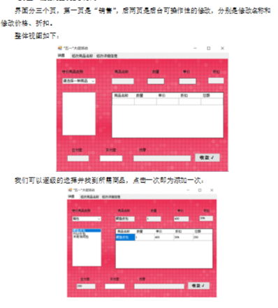
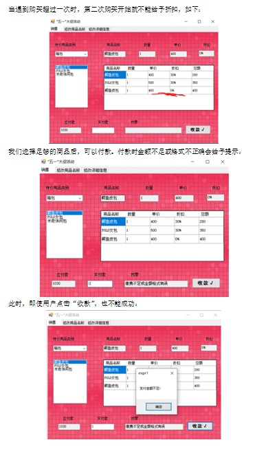
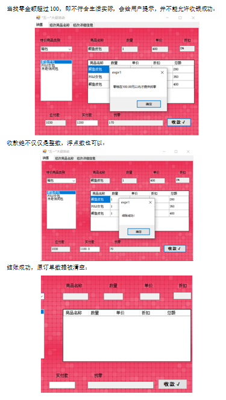
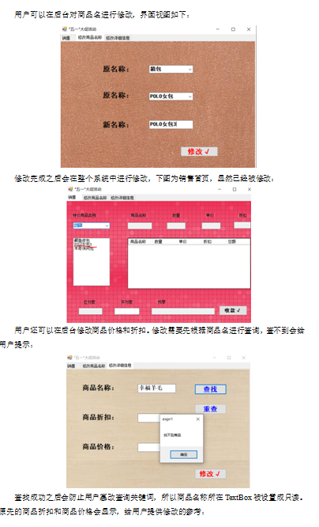
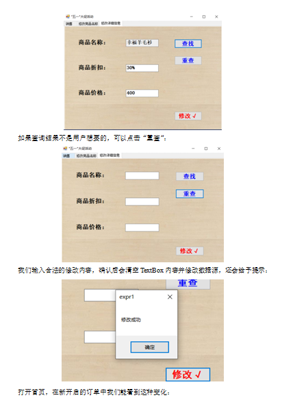
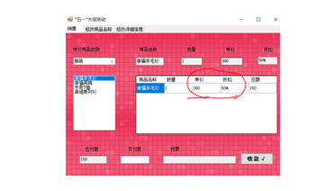

# VB.NET个人信息管理系统

## 实验内容

开发一个个人信息管理系统。该系统的基本需求功能如下：
- 个人基本信息管理
- 通讯录管理
- 电子日记本管理
- 电子小账簿管理

要求使用文件持久化存储数据。

## 编程实现

```vbnet
Imports System.IO
Imports System.Text

Public Class Form1

    Private Sub Form1_Load(sender As Object, e As EventArgs) Handles MyBase.Load
        Using DRReader As New Microsoft.VisualBasic.FileIO.TextFieldParser("D:\VB\expr2\expr2\MainInfo.txt", System.Text.Encoding.UTF8)
            DRReader.TextFieldType = FileIO.FieldType.Delimited
            DRReader.SetDelimiters("#")
            Dim currentRow As String()
            While Not DRReader.EndOfData
                Try
                    currentRow = DRReader.ReadFields()
                    TextBox1.Text = currentRow(0)
                    TextBox2.Text = currentRow(1)
                    TextBox3.Text = currentRow(2)
                    TextBox5.Text = currentRow(3)
                Catch ex As Microsoft.VisualBasic.FileIO.MalformedLineException
                    MsgBox("Line" & "is not valid and will be skipped.")
                End Try
            End While
        End Using
        Using DRReader As New Microsoft.VisualBasic.FileIO.TextFieldParser("D:\VB\expr2\expr2\FriendsInfo.txt", System.Text.Encoding.UTF8)
            DRReader.TextFieldType = FileIO.FieldType.Delimited
            DRReader.SetDelimiters("\n")
            Dim currentRow As String()
            While Not DRReader.EndOfData
                Try
                    currentRow = DRReader.ReadFields()
                    For Each element In currentRow
                        ListBox1.Items.Add(element)
                    Next
                Catch ex As Microsoft.VisualBasic.FileIO.MalformedLineException
                    MsgBox("Line" & "is not valid and will be skipped.")
                End Try
            End While
        End Using
        Using DRReader As New Microsoft.VisualBasic.FileIO.TextFieldParser("D:\VB\expr2\expr2\NotebookInfo.txt", System.Text.Encoding.UTF8)
            DRReader.TextFieldType = FileIO.FieldType.Delimited
            DRReader.SetDelimiters("\n")
            Dim currentRow As String()
            While Not DRReader.EndOfData
                Try
                    currentRow = DRReader.ReadFields()
                    For Each element In currentRow
                        ListBox2.Items.Add(element)
                    Next
                Catch ex As Microsoft.VisualBasic.FileIO.MalformedLineException
                    MsgBox("Line" & "is not valid and will be skipped.")
                End Try
            End While
        End Using
        Using DRReader As New Microsoft.VisualBasic.FileIO.TextFieldParser("D:\VB\expr2\expr2\AccountBookInfo.txt", System.Text.Encoding.UTF8)
            DRReader.TextFieldType = FileIO.FieldType.Delimited
            DRReader.SetDelimiters("\n")
            Dim currentRow As String()
            While Not DRReader.EndOfData
                Try
                    currentRow = DRReader.ReadFields()
                    For Each element In currentRow
                        ListBox3.Items.Add(element)
                    Next
                Catch ex As Microsoft.VisualBasic.FileIO.MalformedLineException
                    MsgBox("Line" & "is not valid and will be skipped.")
                End Try
            End While
        End Using
    End Sub

    Private Sub Button1_Click(sender As Object, e As EventArgs) Handles Button1.Click
        If TextBox6.Text = "" Or TextBox7.Text = "" Or TextBox8.Text = "" Then
            MsgBox("不能有空信息")
            Return
        ElseIf Not TextBox7.Text Like "[1-9][0-9][0-9][0-9][0-9][0-9][0-9][0-9][0-9][0-9][0-9]" Then
            MsgBox("手机号不合法")
            Return
        End If
        '成功
        Dim tempStr As String = TextBox6.Text & "-" & TextBox7.Text & "-" & TextBox8.Text
        ListBox1.Items.Add(tempStr)
        Dim file As FileStream = New FileStream("D:\VB\expr2\expr2\FriendsInfo.txt", FileMode.Append)
        Dim fileWriter As New StreamWriter(file)
        fileWriter.WriteLine(tempStr)
        fileWriter.Flush()
        MsgBox("添加成功")
        TextBox6.Text = ""
        TextBox7.Text = ""
        TextBox8.Text = ""
    End Sub

    Private Sub Button2_Click(sender As Object, e As EventArgs) Handles Button2.Click
        If TextBox9.Text = "" Then
            MsgBox("写点东西吧")
            Return
        End If
        '成功
        ListBox2.Items.Add(TextBox9.Text)
        Dim file As FileStream = New FileStream("D:\VB\expr2\expr2\NotebookInfo.txt", FileMode.Append)
        Dim fileWriter As New StreamWriter(file)
        fileWriter.WriteLine(TextBox9.Text)
        fileWriter.Flush()
        MsgBox("添加成功")
        TextBox9.Text = ""
    End Sub

    Private Sub Button3_Click(sender As Object, e As EventArgs) Handles Button3.Click
        If TextBox10.Text = "" Or TextBox11.Text = "" Then
            MsgBox("不能有空信息")
            Return
        End If
        '成功
        Dim tempStr As String = TextBox10.Text & "#$" & TextBox11.Text
        ListBox3.Items.Add(tempStr)
        Dim file As FileStream = New FileStream("D:\VB\expr2\expr2\AccountBookInfo.txt", FileMode.Append)
        Dim fileWriter As New StreamWriter(file)
        fileWriter.WriteLine(tempStr)
        fileWriter.Flush()
        MsgBox("添加成功")
        TextBox10.Text = ""
        TextBox11.Text = ""
    End Sub

    Private Sub Command1_Click()
        Shell("explorer.exe https://blog.csdn.net")
    End Sub

    Private Sub Command2_Click()
        Shell("explorer.exe https://github.com")
    End Sub

    Private Sub LinkLabel1_Click(sender As Object, e As EventArgs) Handles LinkLabel1.Click
        Command1_Click()
    End Sub

    Private Sub LinkLabel2_Click(sender As Object, e As EventArgs) Handles LinkLabel2.Click
        Command2_Click()
    End Sub

    Private Sub Button4_Click(sender As Object, e As EventArgs) Handles Button4.Click
        TextBox1.ReadOnly = False
    End Sub

    Private Sub Button5_Click(sender As Object, e As EventArgs) Handles Button5.Click
        TextBox2.ReadOnly = False
    End Sub

    Private Sub Button6_Click(sender As Object, e As EventArgs) Handles Button6.Click
        TextBox5.ReadOnly = False
    End Sub

    Private Sub Button7_Click(sender As Object, e As EventArgs) Handles Button7.Click
        MsgBox("想啥呢你")
    End Sub

    Private Sub Button8_Click(sender As Object, e As EventArgs) Handles Button8.Click
        If TextBox1.ReadOnly And TextBox2.ReadOnly And TextBox5.ReadOnly Then
            MsgBox("没有可改动的项目")
            Return
        ElseIf TextBox1.Text = "" Or TextBox2.Text = "" Or TextBox5.Text = "" Then
            MsgBox("修改信息不能为空")
            Return
        End If
        Dim tempStr As String = TextBox1.Text & "#" & TextBox2.Text & "#" & TextBox3.Text & "#" & TextBox5.Text
        Dim file As FileStream = New FileStream("D:\VB\expr2\expr2\MainInfo.txt", FileMode.Create)
        Dim fileWriter As New StreamWriter(file)
        fileWriter.WriteLine(tempStr)
        fileWriter.Flush()
        TextBox1.ReadOnly = True
        TextBox2.ReadOnly = True
        TextBox5.ReadOnly = True
        MsgBox("修改成功")
    End Sub

End Class
```

## 文件信息

### FriendsInfo.txt

```vbnet
FuGui, Wang-19920002001-Brother
Hua, Li-20019992001-Sister
Zhou-12222222222-223333
Ha-13333333333-4
Luo-12222222222-Nooo

```

### MainInfo.txt

```vbnet
ErGou, Chen#199#12-25#Man

```

### NotebookInfo.txt

```vbnet
I love VB
Yeah
hhhh
emmmmm
dddddddddddddd
ssssssssssssss

```

## 效果演示

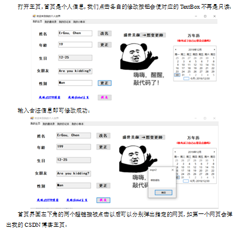
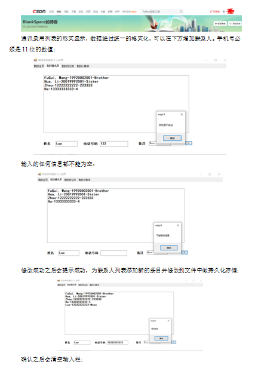
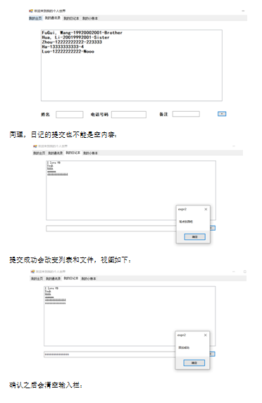
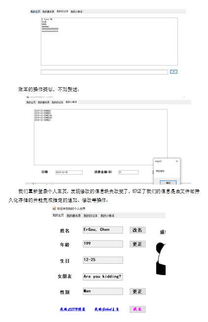
