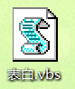
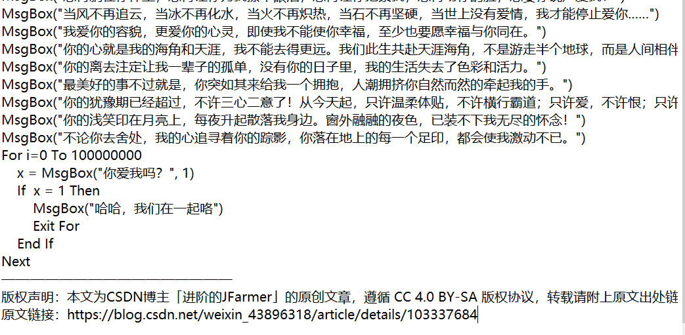
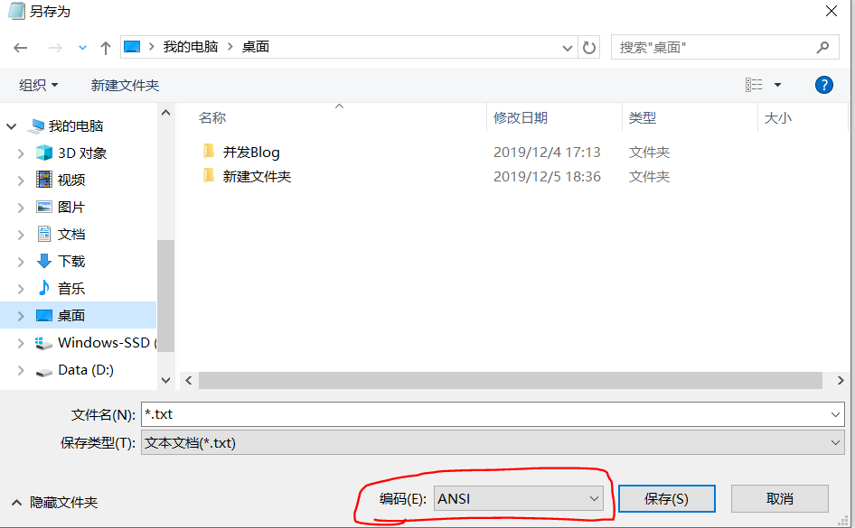
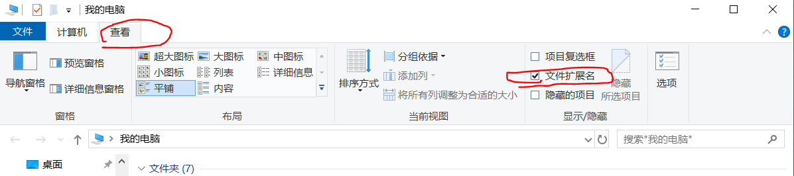

---
title: VisualBasicScript表白程序
date: 2020-09-26 18:50:54
summary: 本文分享一款整活儿向VisualBasicScript表白程序。
tags:
- VBScript
categories:
- 开发技术
---

# 完整代码

```vb
MsgBox("我只想说你是我一直以来想要找的那个人，茫茫人海中，相识了你，是一种缘份，只希望用我的真诚，换取你的真情。")
MsgBox("我的手愿放在你手里，握手深情甜如蜜；我的心愿靠在你心里，心中话永不渝；我的眼愿看在你眼里，望一眼柔情时空也停。")
MsgBox("在你孤独悲伤的日子里，请你悄悄地念一念我的名字。并且说：有人在怀念我，在世上我活在一个人的心里。")
MsgBox("有一种感觉，它没有开端也没有结果，但它却时时刻刻占据我，那就是想你的感觉。")
MsgBox("自从你出现后，我才知道原来有人爱是那么的美好。")
MsgBox("就这样陪你一直走，再久也不会累；陪你在夏日街头漫步，为你撑伞遮挡阳光；为你递上一杯凉茶，让你倍感清凉。这个夏日，有你更美。")
MsgBox("从看到你的那一刻起，我的心跳就告诉我你是我今生等待的人。你给了我勇气和动力，我会用一生的努力来呵护这份心动的。")
MsgBox("数不完的星星，数不完的记忆。弹起我心中的吉它，让心曲飞向远方，伴你进入甜甜的梦乡。")
MsgBox("正是因为爱才悄悄的躲开，躲开的是身影，躲不开的是默默的情怀；今天我终于鼓起勇气，向你表达我的爱。")
MsgBox("我行过许多地方的桥，看过许多次数的云，喝过许多种类的酒，却只爱过一个正当最好年龄的人。")
MsgBox("之前我不相信一见钟情，但是见到你的那一刻，我否定了我的看法。我的心为你沦陷，从此只为你跳动。")
MsgBox("想再躺在你怀里，想再让你为我擦干眼泪，想再让你抱紧我，想再吻你的脸，想要你说声爱我！")
MsgBox("当风不再追云，当冰不再化水，当火不再炽热，当石不再坚硬，当世上没有爱情，我才能停止爱你……")
MsgBox("我爱你的容貌，更爱你的心灵，即使我不能使你幸福，至少也要愿幸福与你同在。")
MsgBox("你的心就是我的海角和天涯，我不能去得更远。我们此生共赴天涯海角，不是游走半个地球，而是人间相伴。")
MsgBox("你的离去注定让我一辈子的孤单，没有你的日子里，我的生活失去了色彩和活力。")
MsgBox("最美好的事不过就是，你突如其来给我一个拥抱，人潮拥挤你自然而然的牵起我的手。")
MsgBox("你的犹豫期已经超过，不许三心二意了！从今天起，只许温柔体贴，不许横行霸道；只许爱，不许恨；只许笑，不许哭。")
MsgBox("你的浅笑印在月亮上，每夜升起散落我身边。窗外融融的夜色，已装不下我无尽的怀念！")
MsgBox("不论你去舍处，我的心追寻着你的踪影，你落在地上的每一个足印，都会使我激动不已。")
For i=0 To 100000000
    x = MsgBox("你爱我吗？", 1)
    If  x = 1 Then
        MsgBox("哈哈，我们在一起咯")
        Exit For
    End If
Next
```

# 运行方法

把文本复制在记事本里，保存为XX.vbs的文件名。


在Windows环境下双击文件即可运行。

# 评论回复

1. 28行“无效字符”的提示报错：

这是CSDN的版权声明，大家自行去掉就行（有的时候会出现，有的时候不会出现，自行处理）。
2. “未结束的字符串常量”：

这个是ANSI编码的，你用UTF-8或者GBK那些其他编码打开自然是报错的。
3. 无法生成这样的logo：

而是记事本图标

你可能是后缀名未去掉，保留后缀名是对学习编程的人比较友好的。
你可以自己调一下：

4. Windows10支持吗？
  我的就是Windows10系统。
5.  表白的神器有了，可是还没遇到那个ta，谁能送我一个？
  不能……不能……不能……
  另：用这个表白……拉黑准备……
6. 运行结果是啥？
  百闻不如一见……
  你不答应TA，程序就不结束……只不过任务管理器可以关掉进程而已，你手动点击X是没用的啊😆
7. 做个文件吧，实在是运行不了？
  对不起啊，不能直接传，我琢磨着这个大家高兴一下，也别费下载积分了大家说是不是？
8. 死循环一下...
  您真狠，还是我比较慈悲为怀，只需要一亿次小循环而已啦
9. 用哪个编译器？
  为降低使用麻烦，直接用记事本编辑，双击运行即可。 
