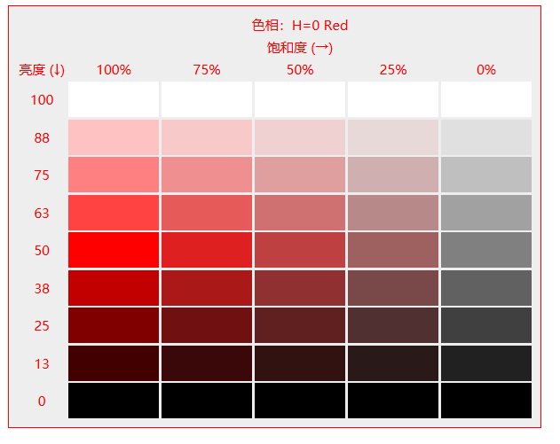

---
title: CSS实现HSL填色表格
date: 2020-02-16 23:14:14
summary: 本文分享CSS实现HSL填色表格的方法。
tags:
- Web前端技术
- CSS
- HTML
categories:
- 开发技术
---

# 示例图



# 网页源码

```html
<!DOCTYPE html>
<html>
  <head>
    <meta http-equiv="content-type" content="text/html" ;charset="utf-8">
    <title>hsl表格</title>
    <style type="text/css">
      table {
        border:solid 1px red;
        background:#eee;
        padding:6px;
      }
      th {
        color:red;
        font-size:12px;
        font-weight:normal;
      }
      td {
        width:80px;
        height:30px;
      }
      tr:nth-child(4) td:nth-of-type(1) { background:hsl(0,100%,100%);}
      tr:nth-child(4) td:nth-of-type(2) { background:hsl(0,75%,100%);}
      tr:nth-child(4) td:nth-of-type(3) { background:hsl(0,50%,100%);}
      tr:nth-child(4) td:nth-of-type(4) { background:hsl(0,25%,100%);}
      tr:nth-child(4) td:nth-of-type(5) { background:hsl(0,0%,100%);}

      tr:nth-child(5) td:nth-of-type(1) { background:hsl(0,100%,88%);}
      tr:nth-child(5) td:nth-of-type(2) { background:hsl(0,75%,88%);}
      tr:nth-child(5) td:nth-of-type(3) { background:hsl(0,50%,88%);}
      tr:nth-child(5) td:nth-of-type(4) { background:hsl(0,25%,88%);}
      tr:nth-child(5) td:nth-of-type(5) { background:hsl(0,0%,88%);}

      tr:nth-child(6) td:nth-of-type(1) { background:hsl(0,100%,75%);}
      tr:nth-child(6) td:nth-of-type(2) { background:hsl(0,75%,75%);}
      tr:nth-child(6) td:nth-of-type(3) { background:hsl(0,50%,75%);}
      tr:nth-child(6) td:nth-of-type(4) { background:hsl(0,25%,75%);}
      tr:nth-child(6) td:nth-of-type(5) { background:hsl(0,0%,75%);}

      tr:nth-child(7) td:nth-of-type(1) { background:hsl(0,100%,63%);}
      tr:nth-child(7) td:nth-of-type(2) { background:hsl(0,75%,63%);}
      tr:nth-child(7) td:nth-of-type(3) { background:hsl(0,50%,63%);}
      tr:nth-child(7) td:nth-of-type(4) { background:hsl(0,25%,63%);}
      tr:nth-child(7) td:nth-of-type(5) { background:hsl(0,0%,63%);}

      tr:nth-child(8) td:nth-of-type(1) { background:hsl(0,100%,50%);}
      tr:nth-child(8) td:nth-of-type(2) { background:hsl(0,75%,50%);}
      tr:nth-child(8) td:nth-of-type(3) { background:hsl(0,50%,50%);}
      tr:nth-child(8) td:nth-of-type(4) { background:hsl(0,25%,50%);}
      tr:nth-child(8) td:nth-of-type(5) { background:hsl(0,0%,50%);}

      tr:nth-child(9) td:nth-of-type(1) { background:hsl(0,100%,38%);}
      tr:nth-child(9) td:nth-of-type(2) { background:hsl(0,75%,38%);}
      tr:nth-child(9) td:nth-of-type(3) { background:hsl(0,50%,38%);}
      tr:nth-child(9) td:nth-of-type(4) { background:hsl(0,25%,38%);}
      tr:nth-child(9) td:nth-of-type(5) { background:hsl(0,0%,38%);}

      tr:nth-child(10) td:nth-of-type(1) { background:hsl(0,100%,25%);}
      tr:nth-child(10) td:nth-of-type(2) { background:hsl(0,75%,25%);}
      tr:nth-child(10) td:nth-of-type(3) { background:hsl(0,50%,25%);}
      tr:nth-child(10) td:nth-of-type(4) { background:hsl(0,25%,25%);}
      tr:nth-child(10) td:nth-of-type(5) { background:hsl(0,0%,25%);}

      tr:nth-child(11) td:nth-of-type(1) { background:hsl(0,100%,13%);}
      tr:nth-child(11) td:nth-of-type(2) { background:hsl(0,75%,13%);}
      tr:nth-child(11) td:nth-of-type(3) { background:hsl(0,50%,13%);}
      tr:nth-child(11) td:nth-of-type(4) { background:hsl(0,25%,13%);}
      tr:nth-child(11) td:nth-of-type(5) { background:hsl(0,0%,13%);}

      tr:nth-child(12) td:nth-of-type(1) { background:hsl(0,100%,0%);}
      tr:nth-child(12) td:nth-of-type(2) { background:hsl(0,75%,0%);}
      tr:nth-child(12) td:nth-of-type(3) { background:hsl(0,50%,0%);}
      tr:nth-child(12) td:nth-of-type(4) { background:hsl(0,25%,0%);}
      tr:nth-child(12) td:nth-of-type(5) { background:hsl(0,0%,0%);}

    </style>
  </head>

  <body>
    <table class="hsl">
      <tbody>
        <tr>
          <th>&nbsp;</th>
          <th colspan="5">色相：H=0 Red </th>
        </tr>
        <tr>
          <th>&nbsp;</th>
          <th colspan="5">饱和度 (&rarr;)</th>
        </tr>
        <tr>
          <th>亮度 (&darr;)</th>
          <th>100% </th>
          <th>75% </th>
          <th>50% </th>
          <th>25% </th>
          <th>0% </th>
        </tr>
        <tr>
          <th>100 </th>
          <td>&nbsp;</td>
          <td>&nbsp;</td>
          <td>&nbsp;</td>
          <td>&nbsp;</td>
          <td>&nbsp;</td>
        </tr>
        <tr>
          <th>88 </th>
          <td>&nbsp;</td>
          <td>&nbsp;</td>
          <td>&nbsp;</td>
          <td>&nbsp;</td>
          <td>&nbsp;</td>
        </tr>
        <tr>
          <th>75 </th>
          <td>&nbsp;</td>
          <td>&nbsp;</td>
          <td>&nbsp;</td>
          <td>&nbsp;</td>
          <td>&nbsp;</td>
        </tr>
        <tr>
          <th>63 </th>
          <td>&nbsp;</td>
          <td>&nbsp;</td>
          <td>&nbsp;</td>
          <td>&nbsp;</td>
          <td>&nbsp;</td>
        </tr>
        <tr>
          <th>50 </th>
          <td>&nbsp;</td>
          <td>&nbsp;</td>
          <td>&nbsp;</td>
          <td>&nbsp;</td>
          <td>&nbsp;</td>
        </tr>
        <tr>
          <th>38 </th>
          <td>&nbsp;</td>
          <td>&nbsp;</td>
          <td>&nbsp;</td>
          <td>&nbsp;</td>
          <td>&nbsp;</td>
        </tr>
        <tr>
          <th>25 </th>
          <td>&nbsp;</td>
          <td>&nbsp;</td>
          <td>&nbsp;</td>
          <td>&nbsp;</td>
          <td>&nbsp;</td>
        </tr>
        <tr>
          <th>13 </th>
          <td>&nbsp;</td>
          <td>&nbsp;</td>
          <td>&nbsp;</td>
          <td>&nbsp;</td>
          <td>&nbsp;</td>
        </tr>
        <tr>
          <th>0 </th>
          <td>&nbsp;</td>
          <td>&nbsp;</td>
          <td>&nbsp;</td>
          <td>&nbsp;</td>
          <td>&nbsp;</td>
        </tr>
      </tbody>
    </table>
  </body>
</html>
```
