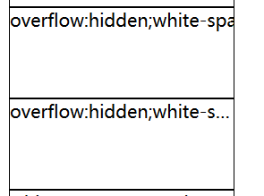
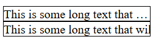
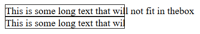
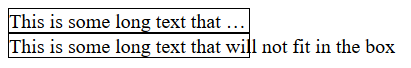

---
title: CSS实现可选显示截断文字
date: 2020-02-16 23:48:26
summary: 本文分享CSS实现可选显示截断文字的实现方法。
tags:
- Web前端技术
- CSS
- HTML
categories:
- 开发技术
---

# 原始版本

原版本在文字溢出的时候只做简单的裁剪或者加上截断符号，但被截断的文字就不可查了。

## CSS选择器

```html
div {
  border:1px solid #000000;
  height: 80px;
  width: 200px;
}
```

## HTML标签

```html
<!--当文字溢出的时候只做简单的裁剪-->
<div style="overflow:hidden;white-space:nowrap;text-overflow:clip;">
  overflow:hidden;white-space:nowrap;text-overflow:clip;
</div>
<!--当文字溢出的时候裁剪之后显示裁剪标记-->
<div style="overflow:hidden;white-space:nowrap;text-overflow:ellipsis;">
  overflow:hidden;white-space:nowrap;text-overflow:ellipsis;
</div>
```

## 效果展示



## 完整链接

[Link](https://blog.csdn.net/weixin_43896318/article/details/104342072)

# 升级版本

升级的部分就是既能做到截断溢出的部分，还能在鼠标指针移到截断处的时候将被截掉的部分在范围外显示出来。

## 网页源码

```html
<!DOCTYPE html>
<html>
  <meta http-equiv="content-type" content="text/html" ;charset="utf-8">
  <title>文字溢出问题</title>
  <head>
    <style>
      div.test{
        white-space:nowrap;
        width:12em;
        overflow:hidden;
        border:1px solid #000000;
      }
      div.test:hover{
        text-overflow:inherit;
        overflow:visible;
      }
    </style>
  </head>
  <body>
    <div class="test" style="text-overflow:ellipsis;">This is some long text that will not fit in thebox</div>
    <div class="test" style="text-overflow:clip;">This is some long text that will not fit in the box</div>
  </body>
</html>
```

## 演示说明

页面一开始是这样的：


可见，溢出的部分就被截断了。

我们把鼠标移到二者的末尾处：



溢出的文字在范围外显示出来了，这就是我们需要的效果。
