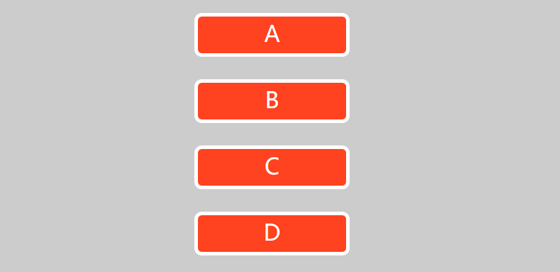
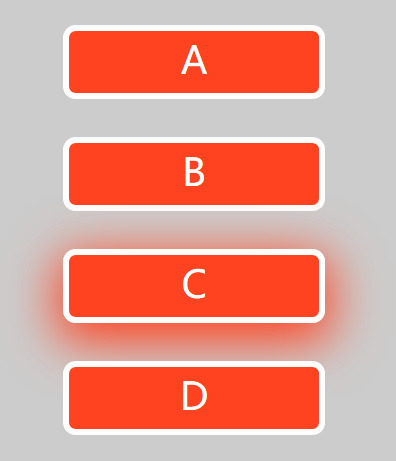

---
title: CSS实现带光晕的网页按钮
date: 2020-02-16 22:55:05
summary: 本文分享CSS实现带光晕的网页按钮的方法。
tags:
- Web前端技术
- CSS
- HTML
categories:
- 开发技术
---

# 效果图

静态的界面是这样的：


当鼠标移动到类似于Button的部分上的时候，会出现指定颜色的光晕（这里设置的颜色与模拟Button颜色一致）：


# 网页源码

```html
<!DOCTYPE html>
<html>
  <head>
    <meta http-equiv="content-type" content="text/html" ;charset="UTF-8">
    <title>Red-Button</title>
    <style>
      body{
        background:#ccc;
      }
      div{
        width:200px;
        height:50px;
        margin:30px auto;
        font-size:30px;
        line-height:45px;
        text-align:center;
        color:#fff;
        border:5px solid #fff;
        border-radius:10px;
        background:#ff421f;
        cursor:pointer;
      }
      div:hover{
        box-shadow:0 10px 40px 5px #ff421f;
      }
    </style>
  </head>
  <body>
    <div>A</div>
    <div>B</div>
    <div>C</div>
    <div>D</div>
  </body>
</html>
```
