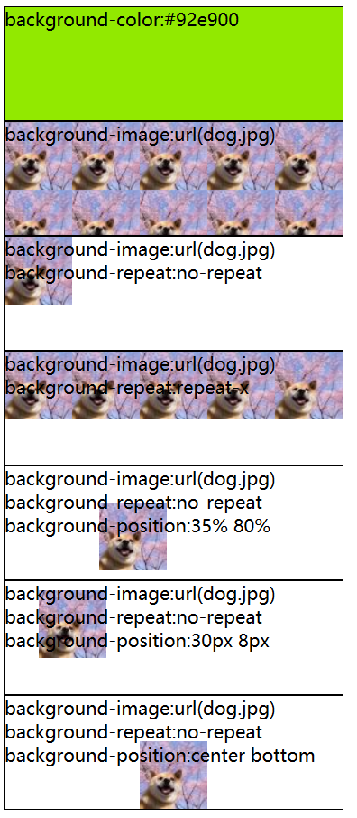
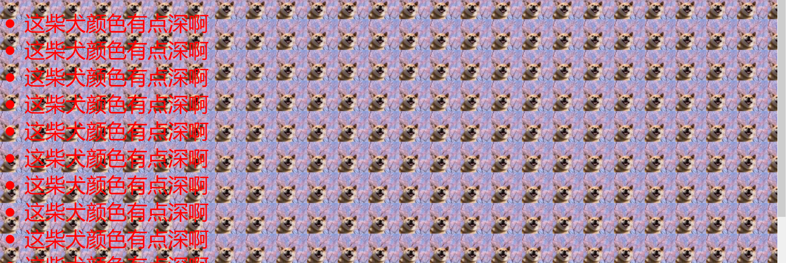
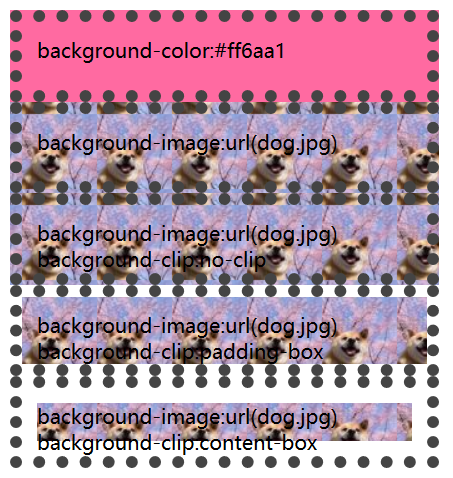
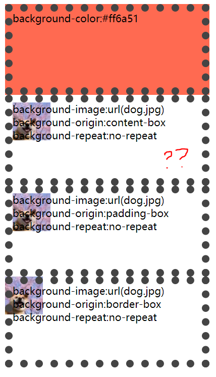
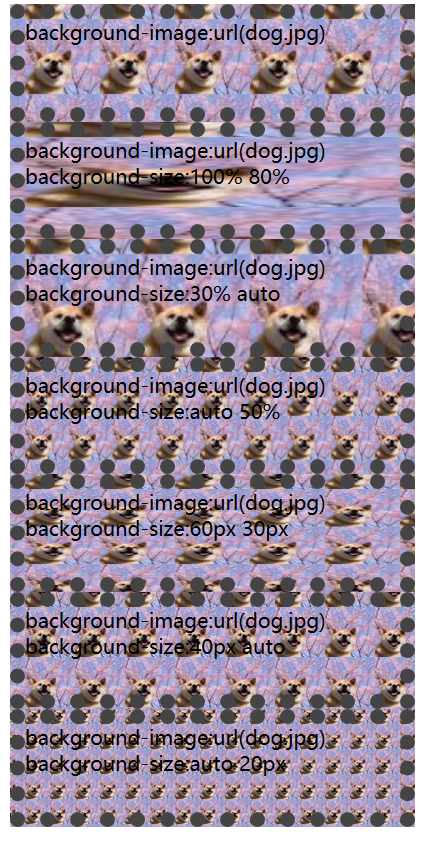
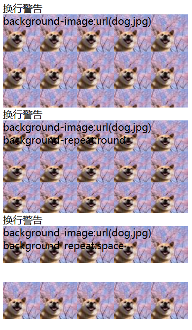
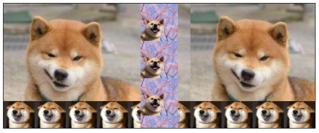

---
title: CSS背景相关属性
date: 2020-02-16 20:39:36
summary: 本文介绍CSS3背景相关属性。
tags:
- Web前端技术
- CSS
- HTML
categories:
- 开发技术
---

# 基本背景属性的应用

```html
<!DOCTYPE html>
<html>
  <head>
    <meta http-equiv="content-type" content="text/html" ;charset="utf-8"/>
    <title>背景属性</title>
    <style type="text/css">
      div {
        border: 1px solid #000;
        height: 100px;
        width:  300px;
      }
    </style>
  </head>
  <body>
    <!--绿色背景-->
    <div style="background-color:#92e900;">
      background-color:#92e900
    </div>
    <!--以默认样式指定背景图片，将会在横向、纵向上平铺-->
    <div style="background-image:url(dog.jpg);">
      background-image:url(dog.jpg)
    </div>
    <!--不平铺的背景图片-->
    <div style="background-image:url(dog.jpg);background-repeat:no-repeat;">
      background-image:url(dog.jpg)
      background-repeat:no-repeat
    </div>
    <!--仅横向平铺的背景图片-->
    <div style="background-image:url(dog.jpg);background-repeat:repeat-x;">
      background-image:url(dog.jpg)
      background-repeat:repeat-x
    </div>
    <!--不平铺的背景图片，并指定背景图片位置-->
    <div style="background-image:url(dog.jpg);background-repeat:no-repeat;background-position:35% 80%;">
      background-image:url(dog.jpg)
      background-repeat:no-repeat
      background-position:35% 80%
    </div>
    <!--不平铺的背景图片，并指定背景图片位置-->
    <div style="background-image:url(dog.jpg);background-repeat:no-repeat;background-position:30px 8px;">
      background-image:url(dog.jpg)
      background-repeat:no-repeat
      background-position:30px 8px
    </div>
    <!--不平铺的背景图片，并指定背景图片位置-->
    <div style="background-image:url(dog.jpg);background-repeat:no-repeat;background-position:center bottom;">
      background-image:url(dog.jpg)
      background-repeat:no-repeat
      background-position:center bottom
    </div>
  </body>
</html>
```



# 背景图片的固定

```html
<!DOCTYPE html>
<html>
  <head>
    <meta http-equiv="content-type" content="text/html" ;charset="utf-8"/>
    <title>背景固定</title>
  </head>
  <body style="background-image:url(dog.jpg); background-attachment:fixed">
    <ul style="font-size:30pt;color:red">
      <script type="text/javascript">
        for (var i = 0; i < 20; i++) {
          document.writeln("<li>这柴犬颜色有点深啊</li>");
        }
      </script>
    </ul>
  </body>
</html>
```



# CSS3新增的background-clip属性的应用

```html
<!DOCTYPE html>
<html>
  <head>
    <meta http-equiv="content-type" content="text/html" ;charset="utf-8"/>
    <title>背景属性</title>
    <style type="text/css">
      div {
        border:  10px dotted #444;
        padding: 12px;
        height:  30px;
        width:   300px;
      }
    </style>
  </head>
  <body>
    <!--粉色背景-->
    <div style="background-color:#ff6aa1;">
      background-color:#ff6aa1
    </div>
    <!--以默认样式指定背景图片，将会在横向、纵向上平铺-->
    <div style="background-image:url(dog.jpg);">
      background-image:url(dog.jpg)
    </div>
    <!--指定背景覆盖盒模型的边框区、内填充区、内容区-->
    <div style="background-image:url(dog.jpg);background-clip:no-clip;">
      background-image:url(dog.jpg)
      background-clip:no-clip
    </div>
    <!--指定背景覆盖盒模型的内填充区、内容区-->
    <div style="background-image:url(dog.jpg);background-clip:padding-box;">
      background-image:url(dog.jpg)
      background-clip:padding-box
    </div>
    <!--指定背景覆盖盒模型的内容区-->
    <div style="background-image:url(dog.jpg);background-clip:content-box;">
      background-image:url(dog.jpg)
      background-clip:content-box
    </div>
  </body>
</html>
```



# CSS3新增的background-origin属性的应用

```html
<!DOCTYPE html>
<html>
  <head>
    <meta http-equiv="content-type" content="text/html" ;charset="utf-8"/>
    <title>背景属性</title>
    <style type="text/css">
      div {
        border: 12px dotted #444;
        height: 120px;
        width:  300px;
      }
    </style>
  </head>
  <body>
    <!--柚色背景-->
    <div style="background-color:#ff6a51;">
      background-color:#ff6a51
    </div>
    <!--背景图片从内容区开始覆盖-->
    <div style="background-image:url(dog.jpg);background-origin:content-box;background-repeat:no-repeat;">
      background-image:url(dog.jpg)
      background-origin:content-box
      background-repeat:no-repeat
    </div>
    <!--背景图片从内填充区开始覆盖-->
    <div style="background-image:url(dog.jpg);background-origin:padding-box;background-repeat:no-repeat;">
      background-image:url(dog.jpg)
      background-origin:padding-box
      background-repeat:no-repeat
    </div>
    <!--背景图片从边框区开始覆盖-->
    <div style="background-image:url(dog.jpg);background-origin:border-box;background-repeat:no-repeat;">
      background-image:url(dog.jpg)
      background-origin:border-box
      background-repeat:no-repeat
    </div>
  </body>
</html>
```



# CSS3新增的background-size属性的应用

```html
<!DOCTYPE html>
<html>
  <head>
    <meta http-equiv="content-type" content="text/html" ;charset="utf-8"/>
    <title>背景属性</title>
    <style type="text/css">
      div {
        border: 12px dotted #444;
        height: 70px;
        width:  300px;
      }
    </style>
  </head>
  <body>
    <!--以默认样式指定背景图片，将会在横向、纵向上平铺-->
    <div style="background-image:url(dog.jpg);">
      background-image:url(dog.jpg)
    </div>
    <!--背景图片宽度与元素宽度相同、高度为元素高度的80%-->
    <div style="background-image:url(dog.jpg);background-size:100% 80%;">
      background-image:url(dog.jpg)
      background-size:100% 80%
    </div>
    <!--背景图片宽度为元素宽度的30%、高度保持纵横比缩放-->
    <div style="background-image:url(dog.jpg);background-size:30% auto">
      background-image:url(dog.jpg)
      background-size:30% auto
    </div>
    <!--背景图片宽度保持纵横比缩放、高度为元素高度的50%-->
    <div style="background-image:url(dog.jpg);background-size:auto 50%;">
      background-image:url(dog.jpg)
      background-size:auto 50%
    </div>
    <!--背景图片宽度为60px、高度为30px-->
    <div style="background-image:url(dog.jpg);background-size:60px 30px;">
      background-image:url(dog.jpg)
      background-size:60px 30px
    </div>
    <!--背景图片宽度为40px、高度保持纵横比缩放-->
    <div style="background-image:url(dog.jpg);background-size:40px auto;">
      background-image:url(dog.jpg)
      background-size:40px auto
    </div>
    <!--背景图片宽度保持纵横比缩放、高度为20px-->
    <div style="background-image:url(dog.jpg);background-size:auto 20px;">
      background-image:url(dog.jpg)
      background-size:auto 20px
    </div>
  </body>
</html>
```



# CSS3为background-repeat新增的space和round的应用

```html
<!DOCTYPE html>
<html>
  <head>
    <meta http-equiv="content-type" content="text/html" ;charset="utf-8"/>
    <title>背景属性</title>
    <style type="text/css">
      div {
        height: 150px;
        width:  300px;
        background-image:url(dog.jpg);
      }
    </style>
  </head>
  <body>
    换行警告
    <!--以默认样式指定背景图片，将会在横向、纵向上平铺-->
    <div>
      background-image:url(dog.jpg)
    </div>
    换行警告
    <!--不平铺的背景图片-->
    <div style="background-repeat:round;">
      background-image:url(dog.jpg)
      background-repeat:round
    </div>
    换行警告
    <!--仅横向平铺的背景图片-->
    <div style="background-repeat:space;">
      background-image:url(dog.jpg)
      background-repeat:space
    </div>
  </body>
</html>
```



# CSS3新增的多背景图片的应用

```html
<!DOCTYPE html>
<html>
  <head>
    <meta http-equiv="content-type" content="text/html" ;charset="utf-8"/>
    <title>背景属性</title>
    <style type="text/css">
      div {
        border:1px solid #000;
        height:200px;
        width:500px;
        background-image: url(dog.jpg), url(dog2.jpg), url(dog3.jpg);
        background-repeat: repeat-y, repeat-x, repeat;
        background-position: center top, left bottom, left top;
      }
    </style>
  </head>
  <body>
    <div id="div"></div>
  </body>
</html>
```


