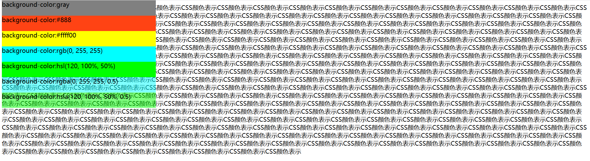

---
title: CSS颜色表示方法
date: 2020-02-16 12:26:17
summary: 本文介绍CSS3颜色表示方法。
tags:
- Web前端技术
- CSS
- HTML
categories:
- 开发技术
---

# 色光三原色原理

色光的三原色是 <font color="red">红色（Red）</font>、<font color="green">绿色（Green）</font>、<font color="blue">蓝色（Blue）</font> 三种，可以构成缤纷的绚丽色彩。

[实在不记得的话，这里左转百度百科](https://baike.baidu.com/item/%E4%B8%89%E5%8E%9F%E8%89%B2/764849?fr=aladdin)

# CSS3支持的颜色表示方法

 - 用颜色英文名称表示。英文名称代表一种颜色，但表示很有限且不易记忆和查询。
 - 用<font color="red">十六进制</font>的颜色表示。色光三原色原理，可以查表。
 - 用 <font color="red">rgb (r, g, b)</font> 表示。色光三原色原理，红色 + 绿色 + 蓝色。
 - 用 <font color="red">hsl (Hue, Saturation, Lightness)</font> 表示。色调 + 饱和度 + 亮度。
 - 用 <font color="red">rgba (r, g, b, a)</font> 表示。色光三原色原理，红色、绿色、蓝色 + 透明度。a ∈ [0, 1]，0代表完全透明。
 - 用 <font color="red">hsla (Hue, Saturation, Lightness, alpha)</font> 表示。色调、饱和度、亮度 + 透明度。alpha ∈ [0, 1]，0代表完全透明。

# 网页源码

```html
<!DOCTYPE html>
<html>
  <head>
    <meta http-equiv="content-type" content="text/html" ;charset="utf-8">
    <title>CSS颜色表示</title>
    <style type="text/css">
      div>div{
        width: 400px;
        height: 40px;
      }
    </style>
  </head>
  <body>
    <script type="text/javascript">
      for (var i = 0; i < 300; i++) {
        document.write("CSS颜色表示");
      }
    </script>
    <div style="position:absolute;top:0px">
      <div style="background-color:gray;">
        background-color:gray
      </div>
      <div style="background-color:#ff4314;">
        background-color:#888
      </div>
      <div style="background-color:#ffff00;">
        background-color:#ffff00
      </div>
      <div style="background-color:rgb(0, 255, 255);">
        background-color:rgb(0, 255, 255)
      </div>
      <div style="background-color:hsl(120, 100%, 50%);">
        background-color:hsl(120, 100%, 50%)
      </div>
      <div style="background-color:rgba(0, 255, 255, 0.5);">
        background-color:rgba(0, 255, 255, 0.5)
      </div>
      <div style="background-color:hsla(120, 100%, 50%, 0.5);">
        background-color:hsla(120, 100%, 50%, 0.5)
      </div>
    </div>
  </body>
</html>
```

# 网页展示



# 说明

之所以在后面加文字，是为了验证透明度。
