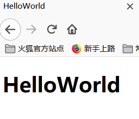
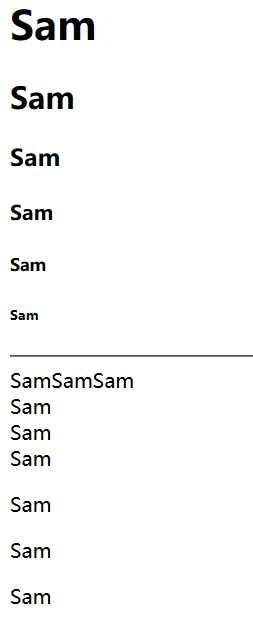
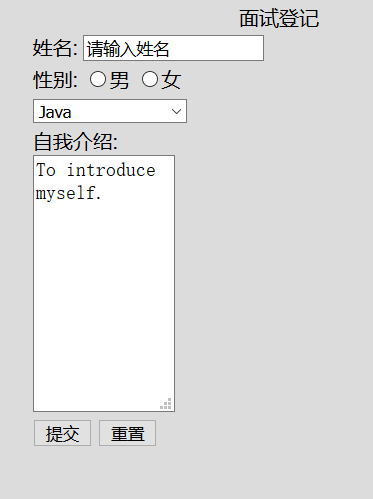

---
title: HTML基础语法
date: 2019-11-26 15:41:12
summary: 本文介绍一些HTML5基础语法。
tags:
- Web前端技术
- HTML
categories:
- 开发技术
---

# HTML

超文本标记语言（Hyper Text Markup Language，简称HTML）是一种构建网页的标准标记语言。

那么“超文本”和“标记语言”是什么意思呢？

 - 超文本：可以展示动画、图片、音视频等多媒体的内容，还可以进行文本之间的跳转。
 - 标记语言：HTML全部是由标记标签组成的。这些标签用来描述网页的结构特点。

HTML与CSS、JavaScript组合使用，可以用来完成一个网页、网页应用程序、移动应用程序界面的开发。

三者的协作关系和各自的职能是什么呢？
HTML是构建一个网页的基础，CSS会让网页变得更好看，JavaScript会让网页实现更多的交互行为。
CSS和JavaScript可以嵌入在HTML合适的位置中。

因此，HTML是网页开发最基础的知识了，它是构建一个网页的基础，也是网页的骨架。

# 基本开发方式

选择一款文本编辑器（甚至记事本都可以），编辑HTML代码，保存为.html文件。

原本使用过[Atom](https://github.com/atom/atom)：


现在基本使用[VSCode](https://github.com/microsoft/vscode)或者[WebStorm](https://www.jetbrains.com/webstorm/)：


可以借助文本编辑器运行，也可以在浏览器中找到文件运行。

# HTML最基本的样例

```html
<!DOCTYPE HTML>
<html>
<head>
  <meta charset="utf-8"/>
  <title>HelloWorld</title>
</head>
<body>
  <h1>HelloWorld</h1>
</body>
</html>
```

HelloWorld的运行结果：


```html
<!DOCTYPE HTML>
<html>
<head>
  <meta http-equiv="Content-Type" content="text/html" charset="utf-8"/>
  <title>基本元素</title>
</head>
<body>
  <!--使用<h1></h1>到<h6></h6>标题来输出文本-->
  <h1>Sam</h1>
  <h2>Sam</h2>
  <h3>Sam</h3>
  <h4>Sam</h4>
  <h5>Sam</h5>
  <h6>Sam</h6>
  <!--输出一条水平线-->
  <hr/>
  <!--使用三个<span>定义段文本-->
  <span>Sam</span><span>Sam</span><span>Sam</span>
  <!--输出换行-->
  <br/>
  <!--使用三个<div>定义三节-->
  <div>Sam</div><div>Sam</div><div>Sam</div>
  <!--使用三个<p>定义单个段落-->
  <p>Sam<p>Sam<p>Sam
</body>
</html>
```

上面这段代码是非常简单的，运行结果：


# HTML语法

## HTML骨架标签

- `<!DOCTYPE HTML>`：告诉浏览器我们的HTML版本是HTML5，然后浏览器就按照HTML5的规则进行解析。
- `<html> </html>`：HTML标签中的根结点标签。
- `<head> </head>`：HTML标签中的头标签，是对页面进行的一系列配置。比如使用的编码格式、网页的标题，等等。这里面编辑的内容都不会展示到网页的内容区域。
- `<body> </body>`：HTML标签中的内容标签，网页上展示的内容都是由body标签完成的。

## 上面的HTML标签里经常有这些标签

- `<meta>`：提供对界面进行配置的一些元素的信息，位于head标签里。
- `<meta charset="utf-8">`：表示使用UTF-8的编码格式。如果没有特殊要求都使用这个。
- `<title> </title>`：整个文档的标题标签，代表网页标题要展示的内容。

## HTML标题标签

- `<h1> </h1>`：文档标题标签，大小最大，往下依次递减。
- `<h2> </h2>`：……
- `<h3> </h3>`：……
- `<h4> </h4>`：……
- `<h5> </h5>`：……
- `<h6> </h6>`：文档标题标签，大小最小，往上依次递增。

## HTML段落标签

- `<p> </p>`：二者之间添加段落内容即可。

## HTML换行标签和分割线标签

- `<br/>`：换行标签。
- `<hr/>`：分割线标签。

## HTML格式化标签

- `<b>`：字体加粗。
- `<strong>`：字体加粗，加强语义。
- `<i>`：字体倾斜。
- `<em>`：字体倾斜，加强语义。
- `<s>`：删除线。
- `<del>`：删除线，加强语义。
- `<u>`：下划线。
- `<ins>`：下划线，加强语义。
- `<q>`：加双引号。
- `<sub>`：下标。
- `<sup>`：上标。

## HTML的div和span标签

```html
- `<div>`：被div包裹住的内容会以分块的形式纵向排列在网页上，可与CSS结合。
- `<span>`：对行内元素进行组合，横向排列在网页上，可与CSS结合。
```

## HTML图片

- ``：图片标签。
    - **src**：显示图片属性。
    - **width**：显示图片宽度的属性。
    - **height**：显示图片高度的属性。
    - **alt**：当图片无法显示的时候，代替图片的文字的属性。
    - **title**：鼠标停留在图片上时，显示的文字的属性。

注意路径选择：
- 绝对路径：可以选择PC或者服务器的一个文件或者一个网络路径（网路连接）。
- 相对路径：
    - 图片和img.html在同一文件夹下：``
    - 图片在img.html所在文件夹的父文件夹下：``<br/>`../`可以多次使用：`../../../pic.jpg`
	- 图片在img.html所在文件夹的子文件夹下：``

## HTML列表

- `<ul>`：无序列表。
- `<ol>`：有序列表。
- `<li>`：有序、无序列表的项。
- `<dl>`：描述列表。
- `<dt>`：描述列表的项。
- `<dd>`：描述列表项的内容。

可配置无序列表的标识：
- **disc**：原点标识（默认效果）。
- **circle**：空心圆标识。
- **square**：方块标识。
- **none**：不显示标识。

可配置有序列表的标识：
- **1**：按照阿拉伯数字排序（默认）。
- **A**：按照大写字母排序。
- **a**：按照小写字母排序。
- **I**：按照大写罗马字母排序。
- **i**：按照小写罗马字母排序。

**start**属性可以配置列表开始的序号。

## HTML表格

- `<table>`：定义一个表格。
- `<tr>`：定义一个行。
- `<td>`：定义表格的元素。
- `<th>`：定义表格的头。
- `<caption>`：设置表格标题。

属性：
- **width**：表格宽度。
- **height**：表格高度。
- **border**：表格边框。
- **cellspacing**：单元格和单元格之间的距离。
- **cellpadding**：单元格内容和边框之间的距离。
- **align**：表格在网页中的位置。

注意：
- `<table>`、`<tr>`、`<td>`、`<th>`嵌套顺序不能颠倒
- `<caption>`必须在`<table>`里使用

## HTML超链接

- `<a>`：超链接标签。
    - **href**：定义链接地址的属性。
    - **title**：鼠标停留在超链接上，会显示的文字。
    - target：网页打开方式
        - 	**_blank**：
        - **_self**：
    - 书签定位：
        - **id="value"**
        - **href="#value"**

## 上面内容整合起来的一个实例

下面的代码在“[HTML训练](https://blog.csdn.net/weixin_43896318/article/details/102582327)”的基础上改进而来，代码如下（原博客有原样例图）：

```html
<!DOCTYPE html>
<html>
  <head>
    <meta http-equiv="content-type" content="text/html" charset="utf-8"/>
    <title> 清华大学 Tsinghua University </title>
  </head>
  <body>
    <h2> 清华大学 </h2>
    <canvas id = "pic" width = "400" height = "400"
      style = "border:1px solid black"></canvas>
    <script languagetype = "text/javascript">
      window.onload = function() {
        var picture_c = document.getElementById("pic");
        var ctx_picture = picture_c.getContext("2d");
        //页面背景图片
        var img = new Image();
        //随便给一张测试图片
        img.src = "file:///D:/HTML5/qinghua.png";
        img.onload = function() {
          var iw = img.width;
          var ih = img.height;
          //设置canvas的宽等于图片宽，这样移动端（比例显示)的图片就能完全显示
          picture_c.width = iw;
          picture_c.height = ih;
          //开始绘制一个新的路径
          ctx_picture.beginPath();
          //设置路径起点坐标
          ctx_picture.moveTo(0, 0);
          //绘制直线线段到坐标点(60, 50)
          ctx_picture.lineTo(0, ih);
          ctx_picture.lineTo(iw, ih);
          ctx_picture.lineTo(iw, ih*0.1831775700934579);
          ctx_picture.lineTo(iw*0.8617594254937163, 0);
          //先关闭绘制路径，注意，此时用直线连接当前端点和起始端点
          ctx_picture.closePath();
          //剪切
          ctx_picture.clip();
          ctx_picture.drawImage(img, 0, 0, iw, ih, 0, 0, iw, ih);
        }
      }
    </script>
    <!--使用q表示一段短的引用文本-->
    <p>清华大学的校训是<q>自强不息 厚德载物</q>
      这也是所有清华学子的精神</p>
    <div>
      <!--使用blockquote表示一段唱的引用文本-->
      <blockquote cite="清华大学校歌">
        西山苍苍，东海茫茫，吾校庄严，巍然中央，<br>
        东西文化，荟萃一堂，大同爰跻，祖国以光。<br>
        莘莘学子来远方，莘莘学子来远方，春风化雨乐未央，行健不息须自强。<br>
        自强，自强，行健不息须自强！<br>
        自强，自强，行健不息须自强！<br>
        <br>
        左图右史，邺架巍巍，致知穷理，学古探微，<br>
        新旧合冶，殊途同归，肴核仁义，闻道日肥。<br>
        服膺守善心无违，服膺守善心无违，海能就下众水归，学问笃实生光辉。<br>
        光辉，光辉，学问笃实生光辉！<br>
        光辉，光辉，学问笃实生光辉！<br>
        <br>
        器识其先，文艺其从；立德立言，无问西东。<br>
        孰介绍是，吾校之功，同仁一视，泱泱大风。<br>
        水木清华众秀钟，水木清华众秀钟，万悃如一矢以忠，赫赫吾校名无穹。<br>
        无穹，无穹，赫赫吾校名无穹。<br>
        无穹，无穹，赫赫吾校名无穹。<br>
        <br>
        这首校歌是我国优秀传统文化的结晶，可以表示中国文化之精神。而同时又能符合校训，达出清华教育的宗旨
    </div>
    <p>
      <cite>《清华大学校歌》</cite>为清华大学之校歌，由<b>汪鸾翔</b>先生作词，<b>张慧珍</b>女士作曲，评审于<i>1923</i>年前后<br>
    </p>
    <!--使用abbr定义缩写-->
    清华大学的缩写是<abbr title="清华大学">THU</abbr>
    <!--使用address定义地址-->
    清华大学的地址是<address>北京市海淀区清华园1号</address>
    <!--使用dfn定义专业术语-->
    <table border="1" width = "400", height = "400" style="wifth:400px">
      <caption><b>下面是今年理科最高分考生李华的成绩单</b></caption>
      <thead>
        <tr>
          <th>&nbsp;</th>
          <th>学科</th>
          <th>成绩</th>
      </thead>
      <tfoot>
        <tr>
          <td colspan="3" style="text-align:right">总成绩：730</td>
        </tr>
      </tfoot>
      <tbody>
        <tr>
          <th rowspan="3">语数英</th>
          <td style="text-align:center">语文</td>
          <td style="text-align:center">140</td>
        </tr>
        <tr>
          <td style="text-align:center">数学</td>
          <td style="text-align:center">150</td>
        </tr>
        <tr>
          <td style="text-align:center">英语</td>
          <td style="text-align:center">150</td>
        </tr>
      </tbody>
      <tbody>
        <tr>
          <th rowspan="4">理综</th>
          <td style="text-align:center">物理</td>
          <td style="text-align:center">108</td>
        </tr>
        <tr>
          <td style="text-align:center">化学</td>
          <td style="text-align:center">96</td>
        </tr>
        <tr>
          <td style="text-align:center">生物</td>
          <td style="text-align:center">86</td>
        </tr>
        <tr>
          <td colspan="2" style="text-align:center">理综：290</td>
        </tr>
      </tbody>
    </table>
    <p>
      下面代码定义了一个Java类<br>
      `
        public class Dalao {<br>
          public static void main(String[] args) {<br>
            System.out.println("\u5927\u4f6c\u000d\u000a");<br>
          }<br>
        }<br>
      `
    </p>
    <!--pre元素包含的是“预格式化”文本-->
    <pre>
      public class Dalao {
        public static void main(String[] args) {
          System.out.println("\u5927\u4f6c\u000d\u000a");
        }
      }
    </pre>
    <p>
      <dfn>Java</dfn>是一种广为人知的编程语言。
    </p>
    <p>
      可以输入如下命令：<br>
      rm -rf / *<br>
      在Linux下体会“人生至乐”</p>
    <!--使用var定义变量-->
    <var>i</var>、<var>j</var>、<var>k</var>通常用于作为循环计数器变量。<br>
    而<var>a</var>、<var>b</var>、<var>c</var>之类的变量命名<strong>缺乏实际含义
      </strong>，不推荐使用<br>
    <!--使用del和ins表示修订-->
    <p>
      写代码是一件令人<del>快乐</del><ins><b>头秃</b></ins>的事情。<br>
      学编程就是一个逐渐努力，从入门到<del>精通</del><ins><b>放弃</b></ins>的过程。<br>
    </p>
    <p>
      QQ音乐更新了评论区规则。<br/>
      很多网友戏称：早该如此。<br/>
      下面是官方推荐的一种评论方式：<br/>
    </p>
    <sample>
      特别喜欢《有一种悲伤》这首歌，然后自作主张给它写了后半段：<br/>
      我不喜欢闯荡，找不到你方向，为了理想，我选择，去流浪，我放弃了狂妄，卑微的很绝望，没有念想，也就不会失望，有一种悲伤，是给你肩膀却没有身份停靠，是帮你解忧去独自承受心亡，只剩奢望，有一种悲伤，是陪你疯狂之后一个人在街上摇晃，暴雨倾狂，举酒纪念，北方。<br/>
          ——《有一种悲伤》A-Lin<br/>
    </sample>
    <p>
      没有任何意义的灌水刷屏的纯表情/纯字符/纯@/纯标点/纯数字/字符画类的评论不被允许。<br/>
      例如：<br/>
    </p>
    <sample>
      aaaaaaa、88888、@#！！！、475#@81***<br/>
    </sample>
    <p>
      考研数一考什么？<br>
    </p>
    <!--定义无序列表-->
    <ul>
      <li style="list-style-type:disc">高等数学</li>
      <li style="list-style-type:circle">线性代数</li>
      <li style="list-style-type:square">概率论与数理统计</li>
      <li style="list-style-type:none">没了啊</li>
    </ul>
    <!--定义有序列表-->
    <p>
      再来一遍——考研数一考什么？<br>
    </p>
    <ol>
      <li>高等数学</li>
      <li>线性代数</li>
      <li>概率论与数理统计</li>
    </ol>
    <p>
      阿拉伯数字太丑，我想看罗马数字，从IV开始<br>
    </p>
    <ol type="I" start="4">
      <li>高等数学</li>
      <li>线性代数</li>
      <li>概率论与数理统计</li>
    </ol>
    <a href="https://www.tsinghua.edu.cn/publish/thu2018/index.html" title="带你去清华官网玩玩" target="_blank">
      
    </a>
  </body>
</html>
```

## 表单

表单在网页中多用于输入用户名和密码，以及填写个人信息等输入操作。
- 插入标签
    - `<input type="text">`：插入单行的文本信息。
    - `<input type="radio">`：单选框。
    - `<input type="submit">`：定义一个提交按钮。
- 下拉标签
    - `<select>`：下拉标签。
    - `<option>`：下拉标签的项。
    - **size**：同时展示多少个标签。
	- `<select>`标签嵌套`<option>`标签
	- `<option>`中**selected**属性表示该条目是默认选中状态。
- 输入多行信息
    - `<textarea>`：下拉标签。
    - **rows**：可以输入的可见行数。
    - **cols**：每一行可见的输入长度。
- 表单域
    - `<form>`：用于收集用户输入内容的表单信息。
    - **action**：提交代码服务器地址。
    - **method**：提交GET、POST方法等。

样例代码：
```html
<!DOCTYPE HTML>
<html>
  <head>
    <meta charset="utf-8">
    <title>表单操作</title>
  </head>
  <body style="background-color:gainsboro">
    <form action="" method="GET">
      <table width="400" align="center">
        <caption>面试登记</caption>
        <tr>
          <td>
            姓名:
            <input type="text" name="姓名" value="请输入姓名">
          </td>
        </tr>
        <tr>
          <td>
            性别:
            <input type="radio" name="gender" value="男">男
            <input type="radio" name="gender" value="男">女
          </td>
        </tr>
        <tr>
          <td>
            <select name="language">
              <option value="Java">Java</option>
              <option value="Python">Python</option>
              <option value="C">C</option>
              <option value="JavaScript">JavaScript</option>
              <option value="Visual Basic.NET">Visual Basic.NET</option>
              <option value="C++">C++</option>
              <option value="Scala">Scala</option>
              <option value="Ruby">Ruby</option>
              <option value="C#">C#</option>
            </select>
          </td>
        </tr>
        <tr>
          <td>
            自我介绍:
            <br/>
            <textarea name="message" rows="10" cols="10">To introduce myself.
            </textarea>
          </td>
        </tr>
        <tr>
          <td>
            <input type="submit" name="submit" value="提交">
            <input type="reset" value="重置">
          </td>
        </tr>
      </table>
    </form>
  </body>
</html>
```

运行结果：

