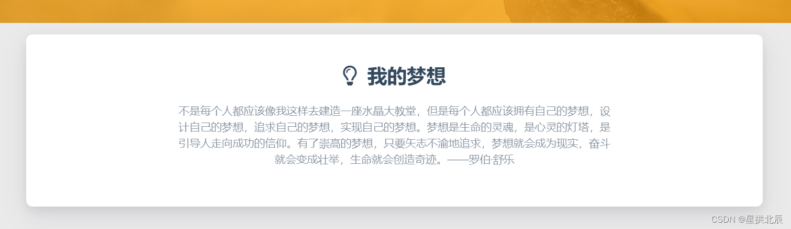
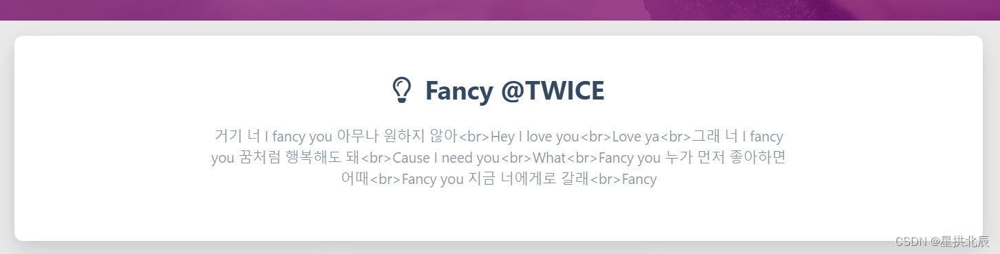
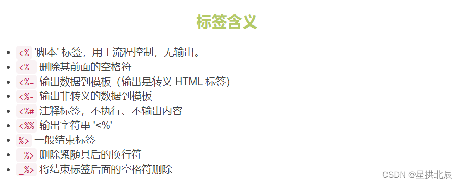
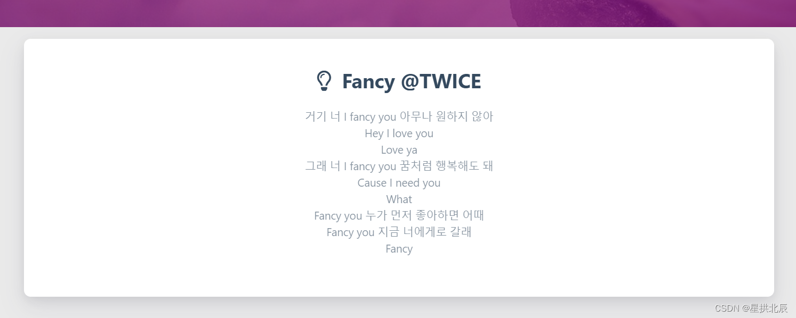

---
title: Hexo配置theme.dream.text文本EJS换行无效问题解决
date: 2022-05-02 14:25:51
summary: 本文分享Hexo配置theme.dream.text文本EJS换行无效问题的解决方法。
tags:
- Web前端技术
- Hexo
categories:
- 开发技术
---

在使用Hexo搭建GitHubPages时，我的模板是这样的：



笔者想要换成自己喜欢的内容，所以选择了TWICE的《Fancy》中的一段歌词：
```text
거기 너 I fancy you 아무나 원하지 않아
Hey I love you
Love ya
그래 너 I fancy you 꿈처럼 행복해도 돼
Cause I need you
What
Fancy you 누가 먼저 좋아하면 어때
Fancy you 지금 너에게로 갈래
Fancy
```

考虑到HTML的换行不是`\n`而是`<br/>`，所以在对应的`_config.yml`中如此填写：
```
fancy:
  enable: true
  showTitle: true
  title: Fancy @TWICE
  text: 거기 너 I fancy you 아무나 원하지 않아<br>Hey I love you<br>Love ya<br>그래 너 I fancy you 꿈처럼 행복해도 돼<br>Cause I need you<br>What<br>Fancy you 누가 먼저 좋아하면 어때<br>Fancy you 지금 너에게로 갈래<br>Fancy
```

显示出的结果却是：



显然，问题出在了可能含HTML标签的文本被直接解析成了纯文本。

查看对应的EJS，使用的是`<div>`和`<%= %>`：

```js
<div class="dream">
    <% if (theme.fancy.showTitle) { %>
    <div class="title center-align">
        <i class="far fa-lightbulb"></i>&nbsp;&nbsp;<%= theme.fancy.title %>
    </div>
    <% } %>
    <div class="row">
        <div class="col l8 offset-l2 m10 offset-m1 s10 offset-s1 center-align text">
            <%= theme.fancy.text %>
        </div>
    </div>
</div>
```

查看EJS官方文档：



将`<%= %>`改成`<%- %>`：

```js
<div class="dream">
    <% if (theme.fancy.showTitle) { %>
    <div class="title center-align">
        <i class="far fa-lightbulb"></i>&nbsp;&nbsp;<%= theme.fancy.title %>
    </div>
    <% } %>
    <div class="row">
        <div class="col l8 offset-l2 m10 offset-m1 s10 offset-s1 center-align text">
            <%- theme.fancy.text %>
        </div>
    </div>
</div>
```



done.
