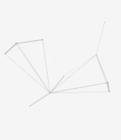
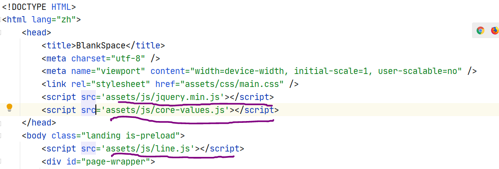

---
title: JavaScript实现单击弹出文字和线条变换
date: 2020-08-28 23:49:13
summary: 鼠标单击核心价值观和线条变换的JavaScript实现。
tags:
- Web前端技术
- JavaScript
categories:
- 开发技术
---

# 前言

`鼠标单击显示核心价值观`、`鼠标落点处线条变换聚集`是两个常见的个人主页js效果，这里分享一下如何使用js实现。

# 核心价值观

`core-values.js`
```js
let index = 0;
jQuery(document).ready(function($) {
    $("body").click(function(e) {
        let string_list = ["¤富强¤", "¤民主¤","¤文明¤", "¤和谐¤", "¤自由¤", "¤平等¤", "¤公正¤" ,"¤法治¤", "¤爱国¤", "¤敬业¤", "¤诚信¤", "¤友善¤"];
        let color_list = ["#ff3333", "#ff8000", "#f9f906", "#b9f20d", "#00ff00", "#00ff80", "#00ffff", "#007fff", "#0000ff", "#7f00ff", "#ff00ff", "#ff0080"];
        let string = $("<span/>").text(string_list[index]);
        let color = color_list[index];
        index= (index + 1) % string_list.length;
        let x = e.pageX, y = e.pageY;
        string.css({ "z-index": 99, "top": y - 20, "left": x, "position": "absolute", "font-weight": "bold", "color": color });
        $("body").append(string);
        string.animate({ "top": y - 180, "opacity": 0 }, 1500, function(){ string.remove(); });
    });
});
```

效果：


# 线条几何变换

`line.js`

```js
!function(){
    function n(n,e,t){
        return n.getAttribute(e)||t
    }
    function e(n){
        return document.getElementsByTagName(n)
    }
    function t(){
        let t = e("script"),o=t.length,i=t[o-1];
        return{l:o,z:n(i,"zIndex",-1),o:n(i,"opacity",.5),c:n(i,"color","0,0,0"),n:n(i,"count",99)}
    }
    function o(){
        a=m.width=window.innerWidth||document.documentElement.clientWidth||document.body.clientWidth, c=m.height=window.innerHeight||document.documentElement.clientHeight||document.body.clientHeight
    }
    function i(){
        r.clearRect(0,0,a,c);
        let n,e,t,o,m,l;
        s.forEach(function(i,x){
            for(i.x+=i.xa,i.y+=i.ya,i.xa*=i.x>a||i.x<0?-1:1,i.ya*=i.y>c||i.y<0?-1:1,r.fillRect(i.x-.5,i.y-.5,1,1),e=x+1;e<u.length;e++)n=u[e], null!==n.x&&null!==n.y&&(o=i.x-n.x,m=i.y-n.y, l=o*o+m*m,l<n.max&&(n===y&&l>=n.max/2&&(i.x-=.03*o,i.y-=.03*m), t=(n.max-l)/n.max,r.beginPath(),r.lineWidth=t/2,r.strokeStyle="rgba("+d.c+","+(t+.2)+")",r.moveTo(i.x,i.y),r.lineTo(n.x,n.y),r.stroke()))
        }), x(i)
    }
    let a,c,u,m=document.createElement("canvas"), d=t(),l="c_n"+d.l,r=m.getContext("2d"),
    x=window.requestAnimationFrame||window.webkitRequestAnimationFrame||window.mozRequestAnimationFrame||window.oRequestAnimationFrame||window.msRequestAnimationFrame||
    function(n){
        window.setTimeout(n,1e3/45)
    },
    w=Math.random,y={x:null,y:null,max:2e4};m.id=l,m.style.cssText="position:fixed;top:0;left:0;z-index:"+d.z+";opacity:"+d.o,e("body")[0].appendChild(m),o(),window.onresize=o,
    window.onmousemove=function(n){
        n=n||window.event,y.x=n.clientX,y.y=n.clientY
    },
    window.onmouseout=function(){
        y.x=null,y.y=null
    };
    for(var s=[],f=0;d.n>f;f++){
        var h=w()*a,g=w()*c,v=2*w()-1,p=2*w()-1;s.push({x:h,y:g,xa:v,ya:p,max:6e3})
    }
    u=s.concat([y]),
    setTimeout(function(){i()},100)
}();
```

效果：


# 引入方式


