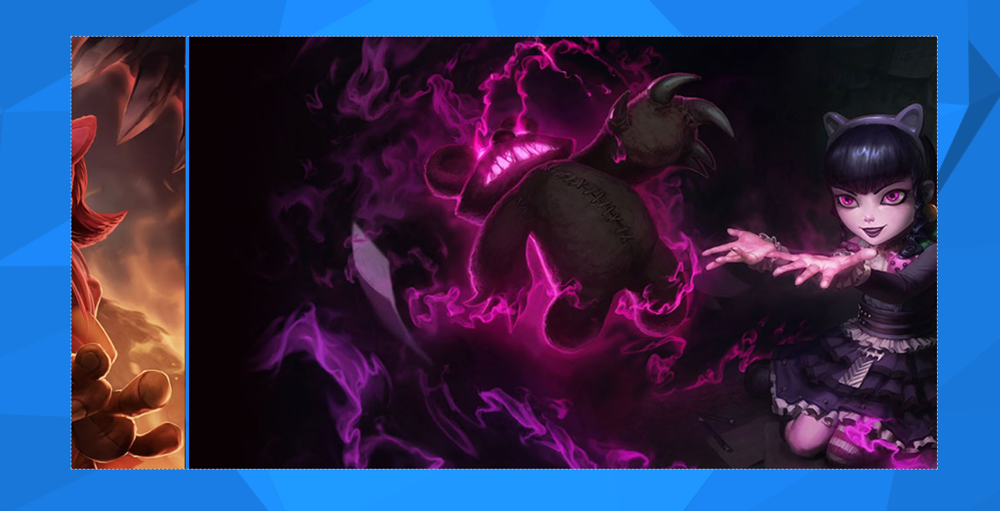
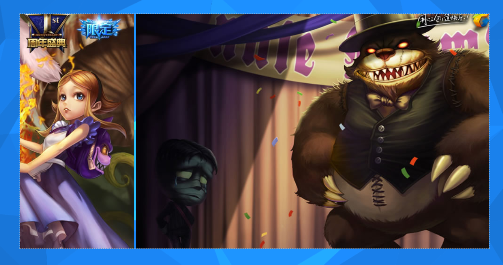

---
title: JavaScript实现图片组无缝轮播
date: 2020-09-26 19:20:38
summary: 本文分享一下JavaScript实现图片组无缝轮播的方法。
tags:
- Web前端技术
- JavaScript
- HTML
categories:
- 开发技术
---

# 网页源码

仅提供HTML文档，不提供CSS和JavaScript文档：

```html
<!DOCTYPE html>
<html>
  <head>
    <meta name="viewport" content="width=device-width, initial-scale=1.0, maximum-scale=1.0, user-scalable=no" />
    <meta http-equiv="Content-Type" content="text/html; charset=utf-8" />
    <meta http-equiv="X-UA-Compatible" content="IE=edge,chrome=1">
    <title>安妮 英雄主页</title>
    <link rel="stylesheet" type="text/css" href="css/style.css">
    <script type="text/javascript" src="js/jquery.min.js"></script>
    <script type="text/javascript" src="js/vector.js"></script>
    <style type="text/css">
      #demo {
        overflow:hidden;
        border: 1px dashed #CCC;
        width: 1000px;
        height:500px;
        position:absolute;
        top:50%;
        left:50%;
        transform:translate(-50%,-50%);
      }
      #indemo {
        float: left;
        clear:both;
        width: 800%;
      }
      #demo1 {
        float: left;
        clear:both;
      }
      #demo2 {
        float: left;
        clear:both;
      }
    </style>
  </head>
  <body id="body">
    <div id="container">
      <div id="demo">
        <div id="indemo">
          <div id="demo1">
            <a href="#"></a>
            <a href="#"></a>
            <a href="#"></a>
            <a href="#"></a>
            <a href="#"></a>
            <a href="#"></a>
          </div>
          <div id="demo2">
          </div>
        </div>
      </div>
    </div>
    <script type="text/javascript">
      Victor("body", "container");
    </script>
    <script type="text/javascript">
      $(function() {
        var speed=1;
        var tab0=document.getElementById("demo");
        var tab1=document.getElementById("demo1");
        var tab2=document.getElementById("demo2");
        tab2.innerHTML=tab1.innerHTML;
        function marquee() {
          if (tab2.offsetWidth-tab0.scrollLeft<=1000) {
            tab0.scrollLeft=0;
          } else {
            tab0.scrollLeft++;
          }
        }
        var myMar=setInterval(marquee,speed);
        tab0.onmouseover=function() {
          clearInterval(myMar)
        };
        tab0.onmouseout=function() {
          myMar=setInterval(marquee,speed)
        };
      });
    </script>
  </body>
</html>
```

# 图片

使用了LOL安妮的五张皮肤图片：


# 效果图





# 简要分析

在自己写了第一版本以后，网上搜了搜，发现普遍的问题是：必须滚动完才能重来。这就意味着会有一段时间的空白期，这就显得不好看。

我自己的处理方式也比较简单，其实无非就是再把第一张图片在末尾加一次，然后在判断<=0的时候把0改为width。
这样的话，比如这6张图，会在第5切到6的时候重来，而实际有用的是前5张（第6张是冗余），然后就能完成所需的视觉效果了！
