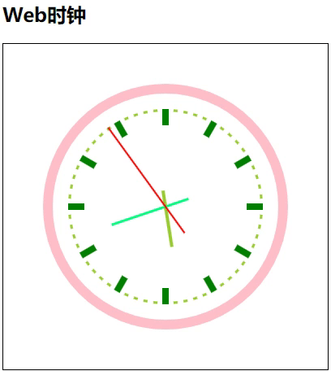

---
title: JavaScript绘制网页时钟
date: 2019-10-14 17:16:02
summary: 本文分享Canvas绘制网页时钟的案例代码，JavaScript实现。
tags:
- Web前端技术
- JavaScript
categories:
- 开发技术
---

# 效果图



# 实现代码

项目结构：
- 📁src
    - 📁css
        - 🗄️style.css
    - 📁js
        - 🗄️index.js
    - 🗄️index.html

## HTML

```html
<!DOCTYPE html>
<html lang="zh">
<head>
    <meta http-equiv="Content-Type" content="text/html; charset=utf-8;"/>
    <title>网页时钟</title>
    <link rel="stylesheet" href="./css/style.css">
</head>
<body>
<h2>Web时钟</h2>
<canvas id="clock" width="400px" height="400px"></canvas>
<script type="text/javascript" src="./js/index.js"></script>
</body>
</html>
```

## CSS

```css
#clock {
    border:1px solid black;
}
```

## JavaScript

```javascript
let myCanvas = document.getElementById('clock');
let c = myCanvas.getContext('2d');

function clock() {
    c.clearRect(0, 0, 400, 400);
    // 获取当前时间
    let data = new Date();
    // 获取秒
    let sec = data.getSeconds();
    // 获取分钟
    let min = data.getMinutes();
    // 获取小时
    let hour = data.getHours();
    c.save();
    c.translate(200, 200);
    c.rotate(-Math.PI / 2);
    // 分针刻度线
    for (let i = 0; i < 60; i++) {    // 画60个刻度线
        c.beginPath();
        c.strokeStyle = "yellowgreen";
        c.lineWidth = 5;
        c.moveTo(117, 0);
        c.lineTo(120, 0);
        c.stroke();
        // 每6deg画一个分钟刻度线
        c.rotate(Math.PI / 30);
        c.closePath();
    }
    // 时钟刻度线
    for (let i = 0; i < 12; i++) {    // 画60个刻度线
        c.beginPath();
        c.strokeStyle = "green";
        c.lineWidth = 8;
        c.moveTo(100, 0);
        c.lineTo(120, 0);
        c.stroke();
        // 每6deg画一个分钟刻度线
        c.rotate(Math.PI / 6);
        c.closePath();
    }
    // 外表盘
    c.beginPath();
    c.strokeStyle = "pink";
    c.arc(0, 0, 145, 0, Math.PI * 2);
    c.lineWidth = 12;
    c.stroke();
    c.closePath();
    // 画时针
    hour = hour > 12 ? hour - 12 : hour;
    // console.log(hour);
    c.beginPath();
    c.save();
    // 设置旋转角度，参数是弧度，角度0-360 弧度角度*Math.PI/180
    c.rotate(Math.PI / 6 * hour + Math.PI / 6 * min / 60 + Math.PI / 6 * sec / 3600);
    c.strokeStyle = "yellowgreen";
    c.lineWidth = 4;
    c.moveTo(-20, 0);
    c.lineTo(50, 0);
    c.stroke();
    c.restore();
    c.closePath();
    // 画分针
    // console.log(min);
    c.beginPath();
    c.save();
    c.rotate(Math.PI / 30 * min + Math.PI / 30 * sec / 60);
    c.strokeStyle = "springgreen";
    c.lineWidth = 3;
    c.moveTo(-30, 0);
    c.lineTo(70, 0);
    c.stroke();
    c.restore();
    c.closePath();
    // 画秒针
    c.beginPath();
    c.save();
    c.rotate(Math.PI / 30 * sec);
    c.strokeStyle = "red";
    c.lineWidth = 2;
    c.moveTo(-40, 0);
    c.lineTo(120, 0);
    c.stroke();
    c.restore();
    c.closePath();
    c.restore();
}

clock();
setInterval(clock, 1000);
```
