---
title: JavaScript绘图可视化
date: 2020-05-11 01:55:27
summary: 本文分享JavaScript的Canvas绘图可视化案例。
tags:
- Web前端技术
- JavaScript
categories:
- 开发技术
---

# 绘制矩形

```html
<!DOCTYPE html>
<html>
<head>
	<meta http-equiv="Content-Type" content="text/html; charset=utf-8" />
	<title> 绘制矩形 </title>
</head>
<body>
  <canvas id="mc" width="300" height="200" style="border:1px solid black"></canvas>
  <script type="text/javascript">
    // 获取canvas元素对应的DOM对象
    var canvas = document.getElementById('mc');
    // 获取在canvas上绘图的CanvasRenderingContext2D对象
    var ctx = canvas.getContext('2d');
    // 设置填充颜色
    ctx.fillStyle = '#f84d4f';
    // 绘制矩形
    ctx.fillRect(50 , 50 , 200 , 100);
  </script>
</body>
</html>
```

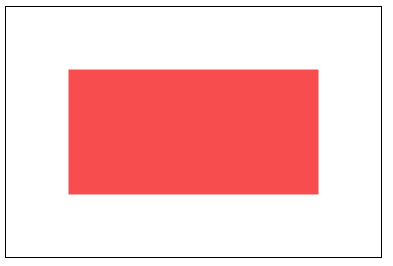

```html
<!DOCTYPE html>
<html>
<head>
  <meta http-equiv="Content-Type" content="text/html; charset=utf-8" />
  <title> 绘制矩形 </title>
</head>
<body>
  <canvas id="mc" width="400" height="350" style="border:1px solid black"></canvas>
  <script type="text/javascript">
    // 获取canvas元素对应的DOM对象
    var canvas = document.getElementById('mc');
    // 获取在canvas上绘图的CanvasRenderingContext2D对象
    var ctx = canvas.getContext('2d');
    // 设置填充颜色
    ctx.fillStyle = '#f74d00';
    // 填充一个矩形
    ctx.fillRect(30 , 20 , 120 , 60);
    // 设置填充颜色
    ctx.fillStyle = '#ff9700';
    // 填充一个矩形
    ctx.fillRect(80 , 60 , 120 , 60);
    // 设置填充颜色
    ctx.fillStyle = '#daee00';
    // 填充一个矩形
    ctx.fillRect(130 , 90 , 120 , 60);
    // 设置线条颜色
    ctx.strokeStyle = "#b203ff";
    // 设置线条宽度
    ctx.lineWidth = 10;
    // 绘制一个矩形边框
    ctx.strokeRect(30 , 200 , 120 , 60);
    // 设置线条颜色
    ctx.strokeStyle = "#19b8ff";
    // 设置线条连接风格
    ctx.lineJoin = "round";
    // 绘制一个矩形边框
    ctx.strokeRect(80 , 230 , 120 , 60);
    // 设置线条颜色
    ctx.strokeStyle = "#51f100";
    // 设置线条连接风格
    ctx.lineJoin = "bevel";
    // 绘制一个矩形边框
    ctx.strokeRect(130 , 260 , 120 , 60);
  </script>
</body>
</html>
```

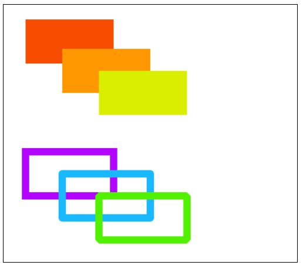

# 点线模式

```html
<!DOCTYPE html>
<html>
<head>
  <meta http-equiv="Content-Type" content="text/html; charset=utf-8" />
  <title> 点线模式 </title>
  <style media="screen">
    body {
      position: absolute;
      top: 50%;
      left: 50%;
      transform: translate(-50%, -50%);
    }
    .center {
      text-align:center
    }
  </style>
</head>
<body>
  <canvas id="mc" width="400" height="280" style="border:1px solid black"></canvas>
	<div class="center">
		<p><b>选择点线模式：</b></p>
		<select id="lineDash" class="center" onchange="changeLineDash(this.value);"></select>
		<p><b>选择点线相位：</b></p>
		<input type="range" id="lineDashOffset" style="width:300px" onchange="changeLineDashOffset(this.value);"/>
	</div>
  <script type="text/javascript">
    // 定义一个数组来代表所有点线模式
    var lineDashArr = [[2, 2], [2.0, 4.0, 2.0], [2.0, 4.0, 6.0], [2.0, 4.0, 2.0, 6.0],
		  [2.0, 2.0, 4.0, 4.0], [2.0, 2.0, 4.0, 6.0, 10.0]];
    var phaseMax = 20;
    var phaseMin = -20;
    // 初始化界面上lineDash元素
    var lineDashEle = document.getElementById("lineDash");
    for (var i = 0; i < lineDashArr.length; i++) {
      lineDashEle.options[i] = new Option(lineDashArr[i], i);
    }
    lineDashEle.options[0].selected = true;
    // 初始化界面上lineDashOffset元素
    var lineDashOffsetEle = document.getElementById("lineDashOffset");
    lineDashOffsetEle.max = phaseMax;
    lineDashOffsetEle.min = phaseMin;
    lineDashOffsetEle.step = 0.1;
    lineDashOffsetEle.value = 0;
    // lineDash变量保存绘图的点线模式
    var lineDash = lineDashArr[0];
    // lineDashOffset变量保存绘图的点线相位
    var lineDashOffset = 0;
    function draw() {
      // 获取canvas元素对应的DOM对象
      var canvas = document.getElementById('mc');
      // 获取在canvas上绘图的CanvasRenderingContext2D对象
      var ctx = canvas.getContext('2d');
      ctx.fillStyle = "#ffffff";
      ctx.fillRect(0, 0, 400, 280);
      // 设置线条颜色
      ctx.strokeStyle = "#0060bf";
      // 设置线条宽度
      ctx.lineWidth = 3;
      // 设置点线模式
      ctx.setLineDash(lineDash);
      // 设置点线模式的相位
      ctx.lineDashOffset = lineDashOffset;
      // 绘制一个矩形边框
      ctx.strokeRect(40 , 60 , 120 , 120);
      ctx.beginPath();
      // 添加一个圆
      ctx.arc(300, 120, 60, 60, 0, Math.PI * 2, true);
      // 添加一条直线
      ctx.moveTo(30 , 30);
      ctx.lineTo(360 , 30);
      // 再添加一条直线
      ctx.moveTo(200 , 50);
      ctx.lineTo(200 , 240);
      ctx.closePath();
      ctx.stroke();
    }
    function changeLineDash(i) {
      lineDash = lineDashArr[i];
      draw();
    }
    function changeLineDashOffset(val) {
      lineDashOffset = val;
      draw();
    }
	draw();
  </script>
</body>
</html>
```

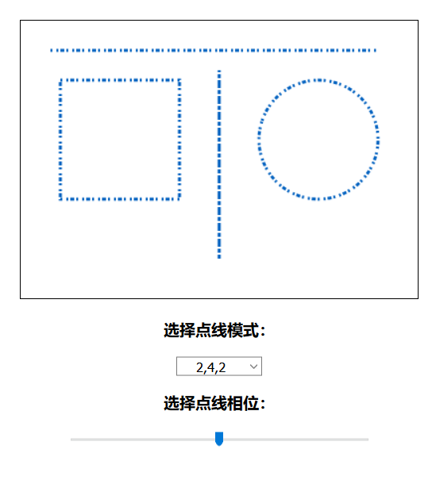

# 绘制艺术字

```html
<!DOCTYPE html>
<html>
<head>
	<meta http-equiv="Content-Type" content="text/html; charset=utf-8" />
	<title> 绘制艺术字 </title>
</head>
<body>
  <canvas id="mc" width="1050" height="130" style="border:1px solid black"></canvas>
  <script type="text/javascript">
    // 获取canvas元素对应的DOM对象
    var canvas = document.getElementById('mc');
    // 获取在canvas上绘图的CanvasRenderingContext2D对象
    var ctx = canvas.getContext('2d');
    ctx.fillStyle = '#b26aff';
    ctx.font = 'italic bold 25px 楷体';
    ctx.textBaseline = 'top';
    // 填充字符串
    ctx.fillText('德玛西亚是一个实力雄厚、奉公守法的国家，有着功勋卓著的光荣军史。', 0, 0);
    ctx.strokeStyle = '#ffaf03';
    ctx.font='bold 30px 仿宋';
    // 绘制字符串的边框
    ctx.strokeText('这里非常重视正义、荣耀、职责的意识形态，这里的人民为此感到强烈自豪。', 0, 50);
    ctx.fillStyle = '#00a802';
    ctx.font='20px 隶书';
    ctx.textBaseline = 'bottom';
    ctx.fillText('德玛西亚是一个自给自足的农耕社会，肥沃的耕地、大片未砍伐的森林、以及矿产储量丰富的山脉遍及全境。', 10, 130);
  </script>
</body>
</html>
```

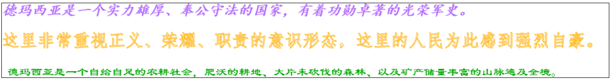

# 绘制圆形路径

```html
<!DOCTYPE html>
<html>
<head>
  <meta http-equiv="Content-Type" content="text/html; charset=utf-8" />
  <title> 绘制圆形路径 </title>
</head>
<body>
  <canvas id="mc" width="350" height="350" style="border:1px solid black"></canvas>
  <script type="text/javascript">
    // 获取canvas元素对应的DOM对象
    var canvas = document.getElementById('mc');
    // 获取在canvas上绘图的CanvasRenderingContext2D对象
    var ctx = canvas.getContext('2d');
    for (var i = 0; i < 10; i++) {
      // 开始定义路径
      ctx.beginPath();
      // 添加一段圆弧
      ctx.arc(30+i*25, 30 + i*25 , (i+1)*8, 0, Math.PI*2, true);
      // 关闭路径
      ctx.closePath();
      // 设置填充颜色
      ctx.fillStyle = 'rgba(255 , 0 , 0 , ' + (10-i)*0.1 + ')';
      // 填充当前路径。
      ctx.fill();
    }
  </script>
</body>
</html>
```

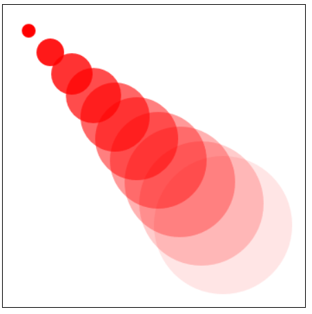

# 绘制圆角矩形

```html
<!DOCTYPE html>
<html>
<head>
  <meta http-equiv="Content-Type" content="text/html; charset=utf-8" />
  <title> 绘制圆角矩形 </title>
</head>
<body>
  <canvas id="mc" width="500" height="300" style="border:1px solid black"></canvas>
  <script type="text/javascript">
    /* 
     * 该方法负责绘制圆角矩形
	 * x1、y2：是圆角矩形左上角的坐标
     * width、height：控制圆角举行的宽、高
     * radius：控制圆角矩形的四个圆角的半径
	 */
    function createRoundRect(ctx, x1, y1, width, height, radius) {
      ctx.beginPath();
      // 移动到左上角
      ctx.moveTo(x1+radius, y1);
      // 添加一条连接到右上角的线段
      ctx.lineTo(x1+width-radius, y1);
      // 添加一段圆弧
      ctx.arcTo(x1+width, y1, x1+width, y1+radius, radius);
      // 添加一条连接到右下角的线段
      ctx.lineTo(x1+width, y1+height-radius);
      // 添加一段圆弧
      ctx.arcTo(x1+width, y1+height, x1+ width-radius, y1+height, radius);
      // 添加一条连接到左下角的线段
      ctx.lineTo(x1+radius, y1+height);
      // 添加一段圆弧
      ctx.arcTo(x1, y1+height, x1, y1+height-radius, radius);
      // 添加一条连接到左上角的线段
      ctx.lineTo(x1, y1+radius);
      // 添加一段圆弧
      ctx.arcTo(x1, y1, x1+radius, y1, radius);
      ctx.closePath();
    }
    // 获取canvas元素对应的DOM对象
    var canvas = document.getElementById('mc');
    // 获取在canvas上绘图的CanvasRenderingContext2D对象
    var ctx = canvas.getContext('2d');
    ctx.lineWidth = 5;
    ctx.strokeStyle = '#0074f1';
    createRoundRect(ctx, 50, 50, 400, 200, 20);
    ctx.stroke();
  </script>
</body>
</html>
```

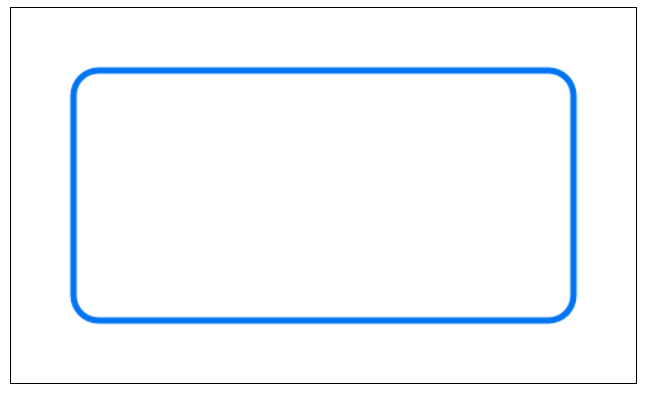

# 绘制凹多边形

```html
<!DOCTYPE html>
<html>
<head>
	<meta http-equiv="Content-Type" content="text/html; charset=utf-8" />
	<title> 绘制凹多边形 </title>
</head>
<body>
  <canvas id="mc" width="460" height="280" style="border:1px solid black"></canvas>
  <script type="text/javascript">
    /*
     * 该方法负责绘制凹多边形
     * n：该参数应设为奇数，控制绘制N角星
     * dx、dy：控制N角星的位置
     * size：控制N角星的大小
     */
	function createStar(context, n, dx, dy, size) {
      // 开始创建路径
      context.beginPath();
      var dig = Math.PI/n*4;
      context.moveTo(dx, size+dy);
      for (var i = 0; i <= n; i++) {
        var x = Math.sin(i*dig);
        var y = Math.cos(i*dig);
        context.lineTo(x*size+dx, y*size+dy);
      }
      context.closePath();
    }
    // 获取canvas元素对应的DOM对象
    var canvas = document.getElementById('mc');
    // 获取在canvas上绘图的CanvasRenderingContext2D对象
    var ctx = canvas.getContext('2d');
    // 绘制凹三边形
    createStar(ctx, 3, 80, 60, 50);
    ctx.fillStyle = "#ff310e";
    ctx.fill();
    // 绘制凹五边形
    createStar(ctx, 5, 180, 60, 50);
    ctx.fillStyle = "#ffb216";
    ctx.fill();
    // 绘制凹七边形
    createStar(ctx, 7, 280, 60, 50);
    ctx.fillStyle = "#fff92d";
    ctx.fill();
    // 绘制凹九边形
    createStar(ctx, 9, 380, 60, 50);
    ctx.fillStyle = "#e4ff19";
    ctx.fill();
		// 绘制凹十一边形
    createStar(ctx, 11, 80, 200, 50);
    ctx.fillStyle = "#55cd00";
    ctx.fill();
    // 绘制凹十三边形
    createStar(ctx, 13, 180, 200, 50);
    ctx.fillStyle = "#00eb91";
    ctx.fill();
    // 绘制凹十五边形
    createStar(ctx, 15, 280, 200, 50);
    ctx.fillStyle = "#14d9ff";
    ctx.fill();
    // 绘制凹十七边形
    createStar(ctx, 17, 380, 200, 50);
    ctx.fillStyle = "#ab49ff";
    ctx.fill();
  </script>
</body>
</html>
```

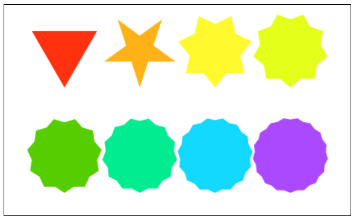

# 绘制曲线

- [《绘制二次贝塞尔曲线》](https://www.jianshu.com/p/9349002be138)
- [《绘制贝塞尔曲线》](https://www.cnblogs.com/wxydigua/p/4204254.html)

# 绘制位图


```html
<!DOCTYPE html>
<html>
<head>
  <meta http-equiv="Content-Type" content="text/html; charset=utf-8" />
  <title> 绘制位图 </title>
</head>
<body>
  <canvas id="mc" width="1250" height="700" style="border:1px solid black"></canvas>
  <script type="text/javascript">
    // 获取canvas元素对应的DOM对象
    var canvas = document.getElementById('mc');
    // 获取在canvas上绘图的CanvasRenderingContext2D对象
    var ctx = canvas.getContext('2d');
    // 创建Image对象
    var image = new Image();
    // 指定Image对象装载图片
    image.src = "cat.jpg";
    // 当图片装载完成时激发该函数
    image.onload = function() {
      // 保持原大小绘制图片
      ctx.drawImage(image, 20, 10);
      // 绘制图片时进行缩放
      ctx.drawImage(image, 700, 10, 100, 100);
      var sw = 210;
      var sh = 150;
      // 从源位图中挖取一块并放大2倍后绘制在Canvas上
      ctx.drawImage(image, 210, 100, sw, sh, 800, 300, sw*2, sh*2);
      sw = 210;
      sh = 200;
      // 从源位图中挖取一块直接绘制在Canvas上
      ctx.drawImage(image, 210, 100, sw, sh, 900, 10, sw, sh);
    }
  </script>
</body>
</html>
```

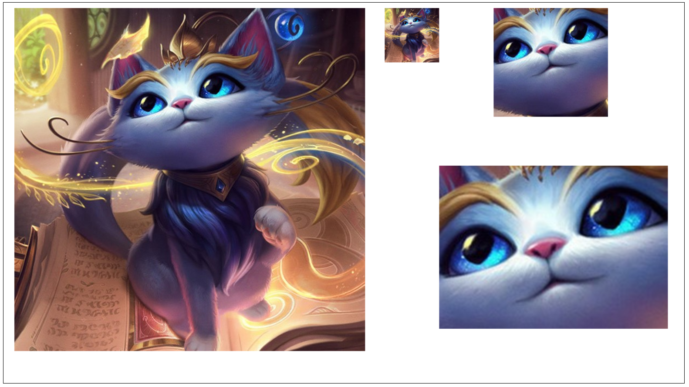

# 绘制坐标变换

- [绘制网螺旋旋转图形](https://blankspace.blog.csdn.net/article/details/102574410)

# 绘制坐标变换与路径结合

```html
<!DOCTYPE html>
<html>
<head>
	<meta http-equiv="Content-Type" content="text/html; charset=utf-8" />
	<title> 绘制雪花飘飘 </title>
	<style media="screen">
	  body {
        position: absolute;
	  	top: 50%;
	  	left: 50%;
	  	transform: translate(-50%, -50%);
  	  }
	</style>
</head>
<body>
  <canvas id="mc" width="520" height="280" style="border:1px solid black"></canvas>
  <script type="text/javascript">
    function createFlower(context, n, dx, dy, size, length) {
      // 开始创建路径
      context.beginPath();
      context.moveTo(dx, dy+size);
      var dig = 2*Math.PI/n;
      for(var i = 1; i < n+1; i++) {
        // 结算控制点坐标
        var ctrlX = Math.sin((i-0.5)*dig)*length+dx;
        var ctrlY= Math.cos((i-0.5)*dig)*length+dy;
        // 结算结束点的坐标
        var x = Math.sin(i*dig)*size+dx;
        var y = Math.cos(i*dig)*size+dy;
        // 绘制二次曲线
        context.quadraticCurveTo(ctrlX, ctrlY, x, y);
      }
      context.closePath();
    }
    // 定义每个雪花的初始位置
    snowPos = [
      {x : 20, y : 4},
      {x : 60, y : 4},
      {x : 100, y : 4},
      {x : 140, y : 4},
      {x : 180, y : 4},
      {x : 220, y : 4},
      {x : 260, y : 4},
      {x : 300, y : 4},
      {x : 340, y : 4},
      {x : 380, y : 4},
      {x : 420, y : 4},
      {x : 460, y : 4},
      {x : 500, y : 4}
    ];
    function fall(context) {
      // 设置采用浅蓝色作为背景填充色
      context.fillStyle = "#2a82ff";
      // 填充矩形
      context.fillRect(0, 0, 520, 280);
      // 设置采用白色作为填充色
      context.fillStyle = "#ffffff";
      for (var i = 0, len = snowPos.length; i < len; i++) {
        // 保存当前绘图状态
        context.save();
        // 平移坐标系统评
        context.translate(snowPos[i].x, snowPos[i].y);
        // 旋转坐标系统
        context.rotate((Math.random()*6-3)*Math.PI/10);
        // 控制雪花下落
        snowPos[i].y += Math.random()*8;
        if (snowPos[i].y > 280) {
          snowPos[i].y = 4;
        }
        // 创建并绘制雪花
        createFlower(context, 6, 0, 0, 5, 8);
        context.fill();
        // 恢复绘图状态
        context.restore();
      }
    }
    // 获取canvas元素对应的DOM对象
    var canvas = document.getElementById('mc');
    // 获取在canvas上绘图的CanvasRenderingContext2D对象
    var ctx = canvas.getContext('2d');
    setInterval("fall(ctx);" , 200);
  </script>
</body>
</html>
```

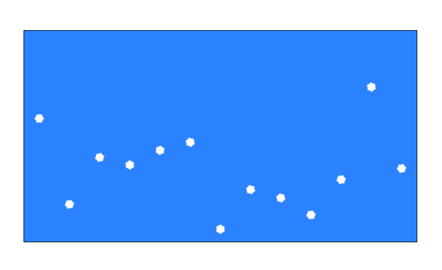

# 绘制矩阵变换

```html
<!DOCTYPE html>
<html>
<head>
  <meta http-equiv="Content-Type" content="text/html; charset=utf-8" />
  <title> 倾斜变换 </title>
  <style media="screen">
	body {
      position: absolute;
	  top: 50%;
	  left: 50%;
	  transform: translate(-50%, -50%);
  	}
  </style>
</head>
<body>
  <canvas id="mc" width="600" height="360" style="border:1px solid black"></canvas>
  <script type="text/javascript">
    function tran(context, angle) {
      // 借助于transform方法实现倾斜变换
	  context.transform(1, 0, -Math.tan(angle), 1, 0, 0);
	}
	// 获取canvas元素对应的DOM对象
	var canvas = document.getElementById('mc');
    // 获取在canvas上绘图的CanvasRenderingContext2D对象
    var ctx = canvas.getContext('2d');
	ctx.fillStyle = "rgba(100, 50, 180, 0.3)";
	// 坐标系统平移到360、5位置
	ctx.translate(360, 5);
	for(var i = 0; i < 30; i++) {
	  // 平移坐标系统
	  ctx.translate(50, 30);
	  // 缩放坐标系统
	  ctx.scale(0.93, 0.93);
	  // 倾斜变换
	  tran(ctx, Math.PI/10);
	  ctx.fillRect(0, 0, 150, 75);
	}
  </script>
</body>
</html>
```

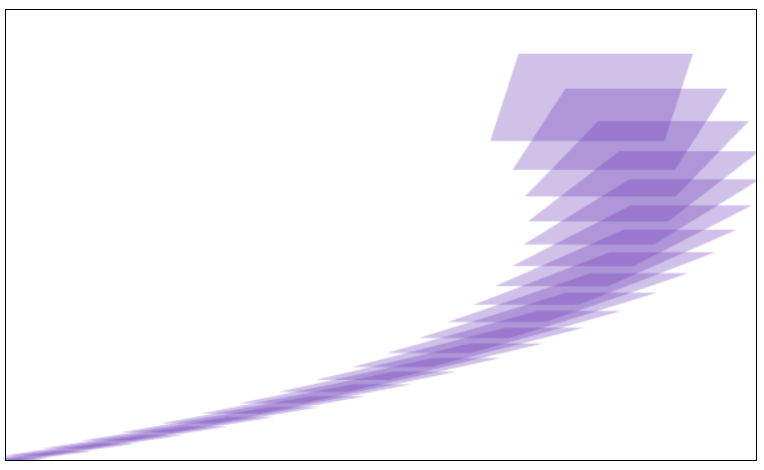

# 绘制叠加效果

```html
<!DOCTYPE html>
<html>
<head>
  <meta http-equiv="Content-Type" content="text/html; charset=utf-8" />
  <title> 叠加风格 </title>
  <style media="screen">
    body {
      position: absolute;
      top: 50%;
      left: 50%;
      transform: translate(-50%, -50%);
  	}
  </style>
</head>
<body>
  选择叠加风格：<select style="width:160px" onchange="draw(this.value);">
    <!--新绘制的图形将会显示在顶层，覆盖以前绘制的图形-->
    <option value="source-over">source-over</option>
    <!--只显示新图形与原图形重叠的部分，新图形与原图形的其他部分都变成透明的-->
    <option value="source-in">source-in</option>
    <!--只显示新图形与原图形不重叠的部分，新图形与原图形的其他部分都变成透明的-->
    <option value="source-out">source-out</option>
    <!--只绘制新图形与原图形重叠部分和原图形未被覆盖的部分，新图形的其他部分变成透明的-->
    <option value="source-atop">source-atop</option>
  	<!--新绘制的图形将放在原图形的后面-->
  	<option value="destination-over">destination-over</option>
  	<!--只显示原图形与新图形重叠的部分，新图形与原图形的其他部分都变成透明的-->
  	<option value="destination-in">destination-in</option>
	  <!--只显示原图形与新图形不重叠的部分，新图形与原图形的其他部分都变成透明的-->
  	<option value="destination-out">destination-out</option>
	  <!--只绘制原图形与新图形重叠部分和新图形未被覆盖的部分，原图形的其他部分变成透明的，不绘制新图形的重叠部分-->
  	<option value="destination-atop">destination-atop</option>
  	<!--新图形和原图形都绘制，重叠部分绘制两种颜色相加的颜色-->
  	<option value="lighter">lighter</option>
  	<!--绘制新图形与原图形不重叠的部分，重叠部分变成透明的-->
  	<option value="xor">xor</option>
  	<!--只绘制新图形，原图形变成透明的-->
  	<option value="copy">copy</option>
	</select><br/><br/>
  <canvas id="mc" width="400" height="200" style="border:1px solid black"></canvas>
  <script type="text/javascript">
    var canvas = document.getElementById('mc');
    // 获取在canvas上绘图的CanvasRenderingContext2D对象
  	var ctx = canvas.getContext('2d');
	var draw = function(compositeOper) {
      // 保存当前的绘图状态
      ctx.save();
      // 获取canvas元素对应的DOM对象
      ctx.clearRect(0, 0, 400, 200);
      // 设置填充颜色为红色
      ctx.fillStyle = '#ff0000';
      // 填充一个矩形
      ctx.fillRect(30, 20, 160, 100);
      // 设置图形叠加风格
      ctx.globalCompositeOperation = compositeOper
      // 设置填充颜色为绿色
      ctx.fillStyle = '#00ff00';
      // 填充一个矩形
      ctx.fillRect(120, 60, 160, 100);
      // 恢复之前保存的绘图状态
      ctx.restore();
    }
    draw("source-over");
  </script>
</body>
</html>
```

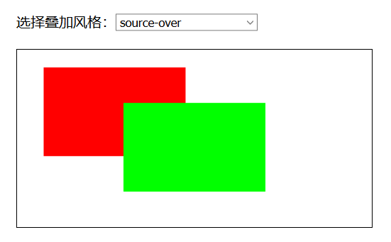

# 绘制线性渐变和径向渐变

- [绘制线性渐变和径向渐变](https://blankspace.blog.csdn.net/article/details/102574275)

# 位图填充


```html
<!DOCTYPE html>
<html>
<head>
  <meta http-equiv="Content-Type" content="text/html; charset=utf-8" />
  <title> 位图填充 </title>
  <style media="screen">
    body {
      position: absolute;
      top: 50%;
	  left: 50%;
	  transform: translate(-50%, -50%);
    }
  </style>
</head>
<body>
  <canvas id="mc" width="450" height="330" style="border:1px solid black"></canvas>
  <script type="text/javascript">
    // 获取canvas元素对应的DOM对象
  	var canvas = document.getElementById('mc');
  	// 获取在canvas上绘图的CanvasRenderingContext2D对象
  	var ctx = canvas.getContext('2d');
	ctx.save();
  	ctx.translate(30, 20);
	var image = new Image();
  	image.src = "rocket_flat.png";
  	image.onload = function() {
	  // 创建位图填充
      imgPattern = ctx.createPattern(image, "repeat");
	  	// 设置使用位图填充作为填充颜色
	  	ctx.fillStyle = imgPattern;
	  	// 填充一个矩形
	  	ctx.fillRect(0, 0, 180, 90);
	  	// 恢复坐标系统
	  	ctx.restore();
	  	// 平移坐标系统
	  	ctx.translate(300, 200)
	  	ctx.beginPath();
	  	// 添加圆弧
	  	ctx.arc(0, 0, 100, 0, Math.PI*2 , true);
	  	ctx.closePath();
	  	ctx.lineWidth = 30;
	  	// 设置使用位图填充作为边框颜色
	  	ctx.strokeStyle = imgPattern;
	  	ctx.stroke();
	  }
  </script>
</body>
</html>
```

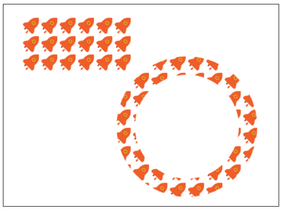

# 位图剪裁


```html
<!DOCTYPE html>
<html>
<head>
	<meta http-equiv="Content-Type" content="text/html; charset=utf-8" />
	<title> 位图裁剪 </title>
</head>
<body>
  <canvas id="mc" width="1240" height="632" style="border:1px solid black"></canvas>
  <script type="text/javascript">
	// 获取canvas元素对应的DOM对象
  	var canvas = document.getElementById('mc');
  	// 获取在canvas上绘图的CanvasRenderingContext2D对象
  	var ctx = canvas.getContext('2d');
	var dig = Math.PI / 20 ;
  	var count = 0;
	var image = new Image();
  	image.src = "cat.jpg";
  	image.onload = function() {
	  // 指定每隔0.1秒调用一次addRadial函数
	 setInterval("addRadial();" , 100);
	}
  	var addRadial = function() {
      // 保存当前的绘图状态
      ctx.save();
	  // 开始创建路径
	  ctx.beginPath();
	  // 添加一段圆弧
	  ctx.arc(600, 250, 200, 0, dig*++count, false);
	  // 让圆弧连接到圆心
	  ctx.lineTo(300, 300);
	  // 关闭路径
	  ctx.closePath();
	  // 剪切路径
	  ctx.clip();
	  // 此时绘制的图片只有路径覆盖的部分才会显示出来
	  ctx.drawImage(image, 124, 20);
	  ctx.restore();
	}
  </script>
</body>
</html>
```

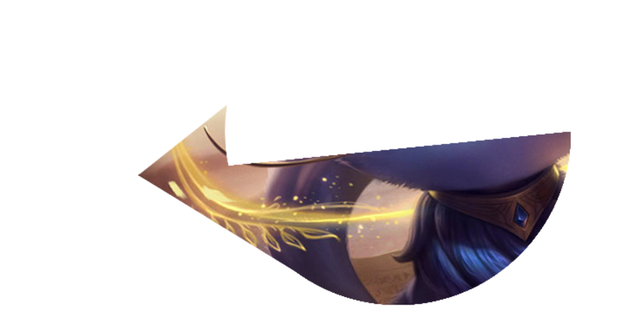

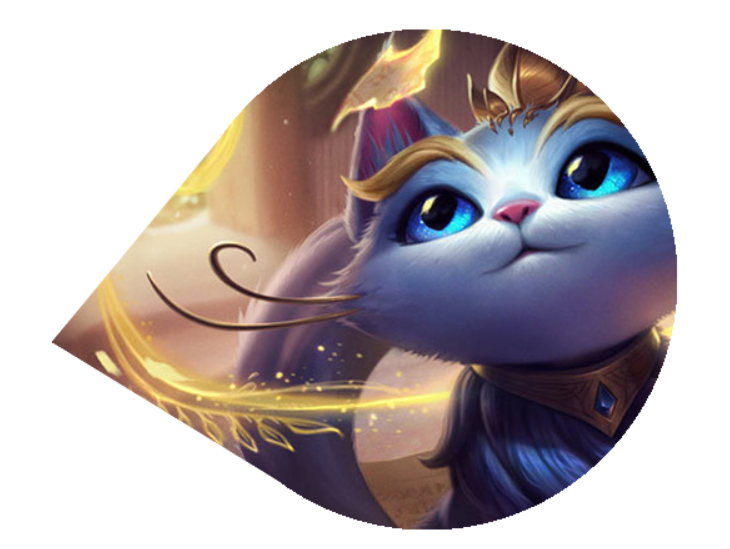

# 改变位图透明度

```html
<!DOCTYPE html>
<html>
<head>
	<meta http-equiv="Content-Type" content="text/html; charset=utf-8" />
	<title> 位图改变透明度 </title>
	<style media="screen">
    body {
      position: absolute;
      top: 50%;
      left: 50%;
      transform: translate(-50%, -50%);
    }
  </style>
</head>
<body>
  <canvas id="mc" width="250" height="250" style="border:1px solid black"></canvas>
  <script type="text/javascript">
    // 获取canvas元素对应的DOM对象
    var canvas = document.getElementById('mc');
    // 获取在canvas上绘图的CanvasRenderingContext2D对象
    var ctx = canvas.getContext('2d');
    var image = new Image();
    image.src = "rocket_flat.png";
    image.onload = function() {
    // 用带透明度参数的方法绘制图片
    drawImage(image, 25, 25, 0.4);
    var drawImage = function(image, x, y, alpha) {
      // 绘制图片
      ctx.drawImage(image, x, y);
      // 获取从x、y开始，宽为image.width、高为image.height的图片数据
      // 也就是获取绘制的图片数据
      var imgData = ctx.getImageData(x, y, image.width, image.height);
      for (var i = 0, len = imgData.data.length; i < len; i += 4) {
        // 改变每个像素的透明度
        imgData.data[i+3] = imgData.data[i+3] * alpha;
      }
      // 将获取的图片数据放回去。
      ctx.putImageData(imgData, x, y);
    }
  </script>
</body>
</html>
```


# 输出位图

```html
<!DOCTYPE html>
<html>
<head>
  <meta http-equiv="Content-Type" content="text/html; charset=utf-8" />
  <title> 位图输出 </title>
  <style media="screen">
    body {
      position: absolute;
      top: 50%;
      left: 50%;
      transform: translate(-50%, -50%);
    }
  </style>
</head>
<body>
  <canvas id="mc" width="380" height="350" style="border:1px solid black"></canvas>
  
  <script type="text/javascript">
    var canvas = document.getElementById('mc');
    var context = canvas.getContext('2d');
    context.fillStyle = "#ffffff";
    context.fillRect(0, 0, 380, 350);
    context.translate(200, 50);
    context.fillStyle = 'rgba(255, 0, 0, 0.25)';
    for (var i = 0; i < 50; i++) {
      context.translate(25, 25);
      context.scale(0.95, 0.95);
      context.rotate(Math.PI/10);
      context.fillRect(0, 0, 100, 50);
    }
  	// 使用img元素来显示Canvas的输出结果
  	document.getElementById("result").src = canvas.toDataURL("image/png");
  </script>
</body>
</html>
```

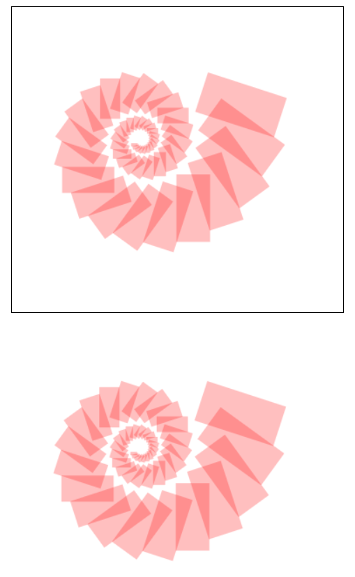

# 基于定时器的动画

```html
<!DOCTYPE html>
<html>
<head>
  <meta http-equiv="Content-Type" content="text/html; charset=utf-8" />
  <title> 基于定时器的简单动画 </title>
  <style media="screen">
    body {
      position: absolute;
      top: 50%;
      left: 50%;
      transform: translate(-50%, -50%);
    }
  </style>
</head>
<body>
  <canvas id="mc" width="380" height="320" style="border:1px solid black"></canvas>
  <script type="text/javascript">
    // 通过prototype为CanvasRenderingContext2D类增加一个方法
    CanvasRenderingContext2D.prototype.fillCircle = function(x, y, radius, pattern) {
      ctx.save();
      ctx.translate(x, y);
      ctx.fillStyle = pattern;
      ctx.beginPath();
      // 添加圆弧
      ctx.arc(0, 0, radius, 0, Math.PI * 2, true);
      ctx.closePath();
      ctx.fill()
      ctx.restore();
	}
	// 获取canvas元素对应的DOM对象
    var canvas = document.getElementById('mc');
	// 获取在canvas上绘图的CanvasRenderingContext2D对象
    var ctx = canvas.getContext('2d');
    var radius = 15;
    var rg = ctx.createRadialGradient(-radius/2, -radius/2, 0, -radius/2, -radius/2, radius*1.67);
    // 向径向渐变上添加颜色
	rg.addColorStop(0.1 , "#f0f0f0");
    rg.addColorStop(0.9 , "#000111");
	var x = canvas.width/2;
	var y = 20;
	var xSpeed = Math.random()*11-5;
	var ySpeed = Math.random()*5+2;
	function draw() {
      ctx.fillStyle = "#ffffff";
      // 清除上一次绘制的内容
      ctx.clearRect(x-radius-2, y-radius-2, x+xSpeed+radius+2, y+ySpeed+radius+2);
      x += xSpeed;
      y += ySpeed;
      // 绘制圆形
      ctx.fillCircle(x, y, 15, rg);
	 // 如果小球到了左边界或右边界，发生碰撞返回
	 if(x <= radius || x >= canvas.width-radius) {
        xSpeed = -xSpeed;
	 }
      // 如果小球到了上边界或下边界，发生碰撞返回
      if(y <= radius || y > canvas.height-radius) {
        ySpeed = -ySpeed;
      }
    }
    // 使用定时器控制每隔30ms执行一次draw函数
	setInterval(draw , 30);
  </script>
</body>
</html>
```

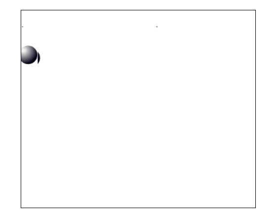
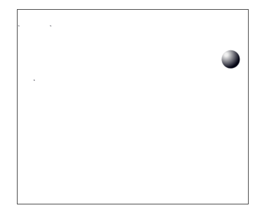

# 基于requestAnimationFrame的动画

```html
<!DOCTYPE html>
<html>
<head>
  <meta http-equiv="Content-Type" content="text/html; charset=utf-8" />
  <title> 简单弹球动画 </title>
  <style media="screen">
    body {
      position: absolute;
      top: 50%;
      left: 50%;
      transform: translate(-50%, -50%);
    }
  </style>
</head>
<body>
  <canvas id="mc" width="380" height="320" style="border:1px solid black"></canvas>
  <script type="text/javascript">
    // 通过prototype为CanvasRenderingContext2D类增加一个方法
	CanvasRenderingContext2D.prototype.fillCircle = function(x, y, radius, pattern) {
      ctx.save();
      ctx.translate(x, y);
      ctx.fillStyle = pattern;
      ctx.beginPath();
      // 添加圆弧
      ctx.arc(0, 0, radius, 0, Math.PI*2, true);
      ctx.closePath();
      ctx.fill()
      ctx.restore();
    }
    // 获取canvas元素对应的DOM对象
    var canvas = document.getElementById('mc');
    // 获取在canvas上绘图的CanvasRenderingContext2D对象
    var ctx = canvas.getContext('2d');
    var radius = 15;
    var rg = ctx.createRadialGradient(-radius/2, -radius/2, 0, -radius/2, -radius/2, radius * 1.67);
    // 向径向渐变上添加颜色
    rg.addColorStop(0.1 , "#f0f0f0");
    rg.addColorStop(0.9 , "#000111");
    var x = canvas.width/2;
    var y = 20;
    var xSpeed = Math.random()*11-5;
    var ySpeed = Math.random()*5+2;
    function draw() {
      ctx.fillStyle = "#ffffff";
      // 清除上一次绘制的内容
      ctx.clearRect(x-radius-2, y-radius-2, x+xSpeed+radius+2, y+ySpeed+radius+2);
      x += xSpeed;
      y += ySpeed;
      // 绘制圆形
      ctx.fillCircle(x, y, 15, rg);
      // 如果小球到了左边界或右边界，发生碰撞返回
      if(x <= radius || x >= canvas.width-radius) {
        xSpeed = -xSpeed;
      }
      // 如果小球到了上边界或下边界，发生碰撞返回
      if(y <= radius || y > canvas.height-radius) {
        ySpeed = -ySpeed;
      }
    }
    function anim() {
      requestAnimationFrame(function() {
        draw();
        anim();
      });
    };
    anim();
  </script>
</body>
</html>
```

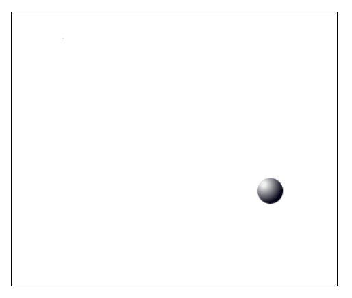
