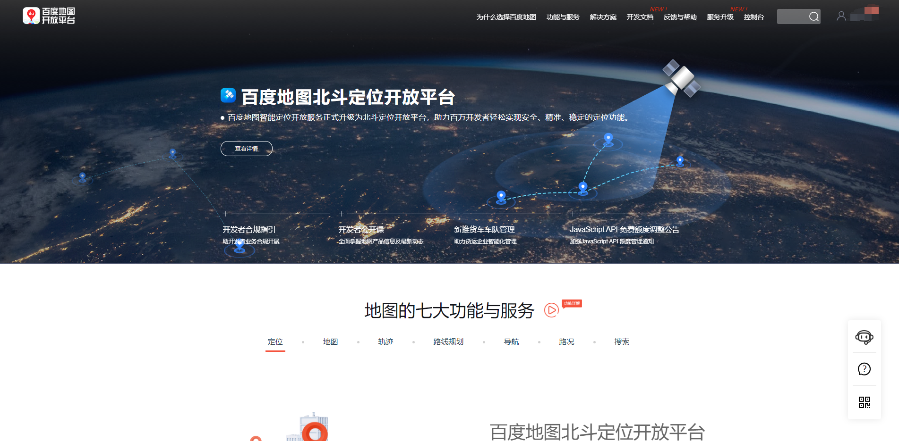
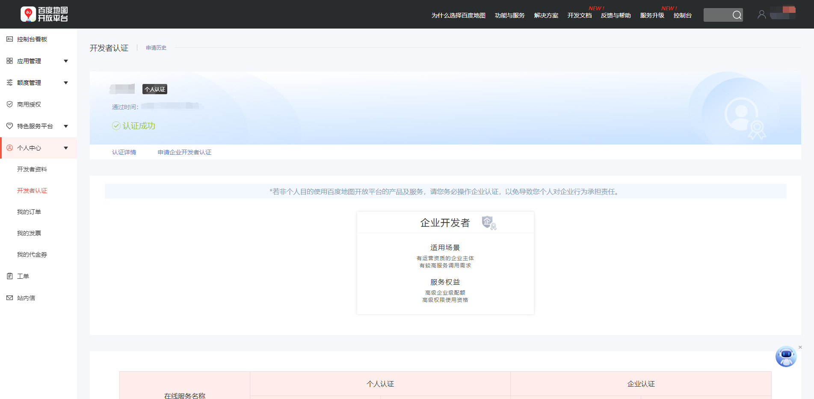
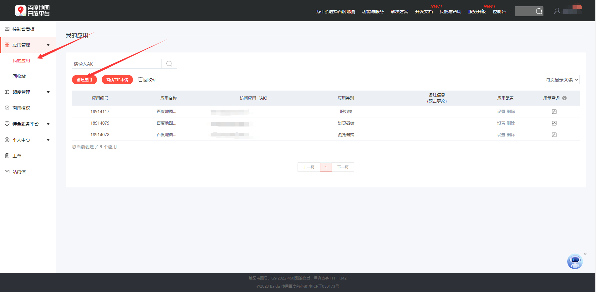
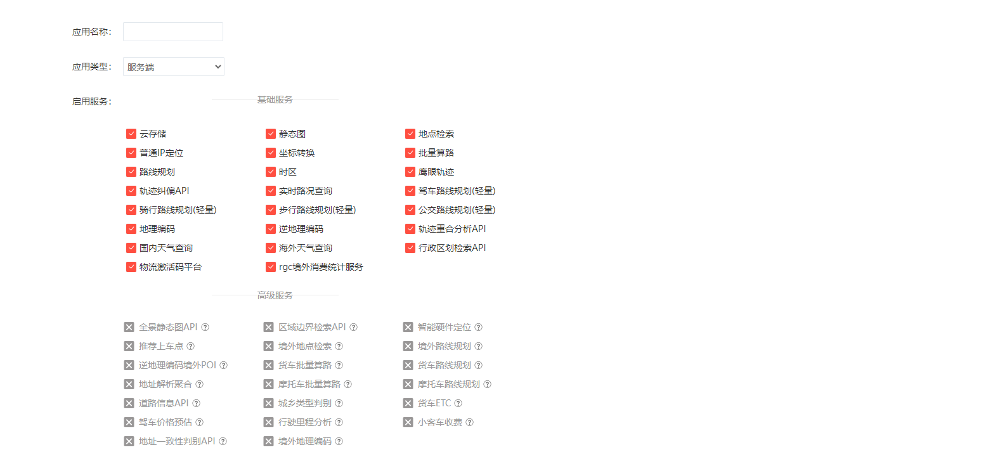
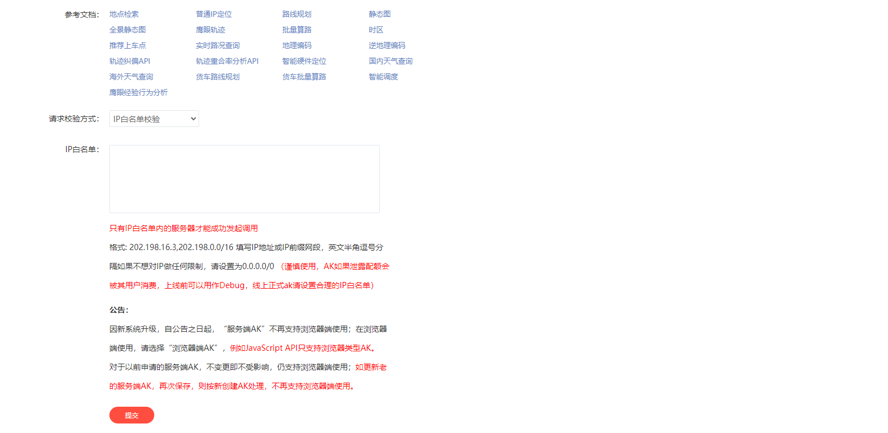
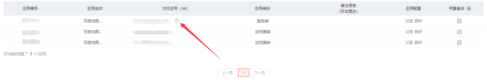

---
title: JavaScript调用百度地图API
date: 2020-03-18 19:16:47
summary: 本文分享百度地图API使用方法和实战案例。
tags:
- Web前端技术
- JavaScript
categories:
- 开发技术
---

# 账号注册

进入百度地图开放平台官网，点击右上角**登录**按钮，进入百度账号登录页面。



如您已经拥有百度账号，请通过扫码/用户名验证的方式直接登录；如您还未拥有百度账号请您点击**注册**完成账号注册。

通过百度账号注册成为百度地图开放平台开发者，选择开发者类型（个人/企业），完成开发者认证即可。



# 获取AK秘钥

进入百度地图开放平台官网控制台，点击**应用管理**-**我的应用**。



点击**创建应用**进入AK申请页面，填写应用名称，务必选择AK类型为“浏览器端”，JS API只支持浏览器端AK进行请求与访问。



为了防止您的AK被盗用，请您务必配置refer白名单，只有该白名单中的网站才能成功发起调用。如下方示例所示，配置了`*.mysite.com*`为域名白名单，即代表域名中包含`.mysite.com`的网站=才可以使用该AK访问JS API的服务



生成AK秘钥后，复制即可用。



# 应用程序开发

统一采用的`style.css`：
```css
html {
    height: 100%
}

body {
    height: 100%;
    margin: 0;
    padding: 0
}

#map {
    height: 100%;
    width: 100%;
}
```

## 地图设置

```html
<!DOCTYPE html>
<html lang="zh">
<head>
    <meta http-equiv="Content-Type" content="text/html; charset=utf-8"/>
    <meta name="viewport" content="initial-scale=1.0, user-scalable=no"/>
    <title>设置地图模式</title>
    <link rel="stylesheet" type="text/css" href="../css/style.css"/>
    <script type="module" src="./index.js"></script>
    <script type="text/javascript" src="//api.map.baidu.com/api?type=webgl&v=1.0&ak=<your_key>"></script>
</head>
<body>
<div id="map"></div>
</body>
</html>
```

```javascript
let map = new BMapGL.Map("map",{
    // 旋转
    enableRotate: false,
    // 倾斜
    enableTilt: true
});
let point = new BMapGL.Point(120.092406,30.308304);
map.centerAndZoom(point, 13);
// 设置地图类型为标准地图
map.setMapType(BMAP_NORMAL_MAP);
// 设置地图类型为地球模式
// map.setMapType(BMAP_EARTH_MAP);
// 设置地图类型为普通卫星地图
// map.setMapType(BMAP_SATELLITE_MAP);
// 开启鼠标滚轮缩放
map.enableScrollWheelZoom(true);
// 设置地图旋转角度
map.setHeading(0);
// 设置地图的倾斜角度
map.setTilt(0);
```

## 添加几何覆盖物

```html
<!DOCTYPE html>
<html lang="zh">
<head>
    <meta http-equiv="Content-Type" content="text/html; charset=utf-8"/>
    <meta name="viewport" content="initial-scale=1.0, user-scalable=no"/>
    <title>几何图形覆盖</title>
    <link rel="stylesheet" type="text/css" href="../css/style.css"/>
    <script type="text/javascript" src="//api.map.baidu.com/api?type=webgl&v=1.0&ak=<your_key>"></script>
</head>
<body>
<div id="map"></div>
<script src="./index.js"></script>
</body>
</html>
```

```javascript
let map = new BMapGL.Map("map");
let point = new BMapGL.Point(116.404, 39.915);

map.centerAndZoom(point, 15);

let marker = new BMapGL.Marker(new BMapGL.Point(116.404, 39.915)); // 创建点
let polyline = new BMapGL.Polyline([
    new BMapGL.Point(116.399, 39.910),
    new BMapGL.Point(116.405, 39.920),
    new BMapGL.Point(116.425, 39.900)
], {strokeColor:"blue", strokeWeight:2, strokeOpacity:0.5});   // 创建折线

let circle = new BMapGL.Circle(point,500,{strokeColor:"blue", strokeWeight:2, strokeOpacity:0.5}); // 创建圆

let polygon = new BMapGL.Polygon([
    new BMapGL.Point(116.387112,39.920977),
    new BMapGL.Point(116.385243,39.913063),
    new BMapGL.Point(116.394226,39.917988),
    new BMapGL.Point(116.401772,39.921364),
    new BMapGL.Point(116.41248,39.927893)
], {strokeColor:"blue", strokeWeight:2, strokeOpacity:0.5});  // 创建多边形

let pStart = new BMapGL.Point(116.392214,39.918985);
let pEnd = new BMapGL.Point(116.41478,39.911901);

let rectangle = new BMapGL.Polygon([
    new BMapGL.Point(pStart.lng,pStart.lat),
    new BMapGL.Point(pEnd.lng,pStart.lat),
    new BMapGL.Point(pEnd.lng,pEnd.lat),
    new BMapGL.Point(pStart.lng,pEnd.lat)
], {strokeColor:"blue", strokeWeight:2, strokeOpacity:0.5});  // 创建矩形

// 添加覆盖物
function add_overlay(){
    map.addOverlay(marker);            // 增加点
    map.addOverlay(polyline);          // 增加折线
    map.addOverlay(circle);            // 增加圆
    map.addOverlay(polygon);           // 增加多边形
    map.addOverlay(rectangle);         // 增加矩形
}

// 清除覆盖物
function remove_overlay(){
    map.clearOverlays();
}

add_overlay();
```

# 更多内容

请阅读：[百度地图API官方文档](https://lbsyun.baidu.com/index.php?title=jspopular/guide/helloworld)
