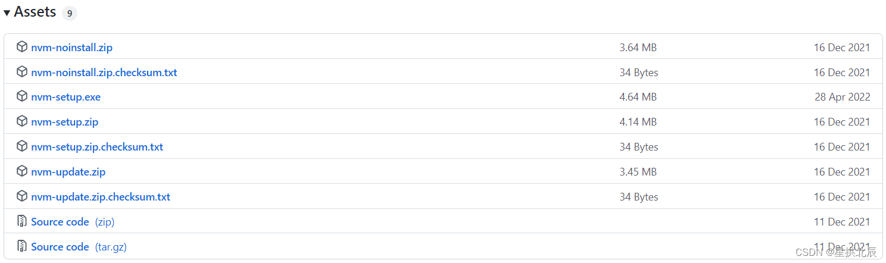
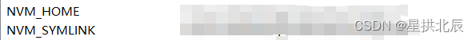
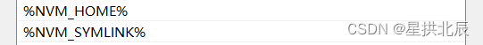
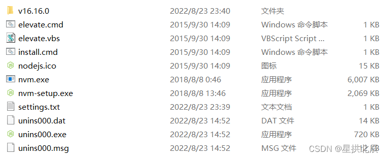
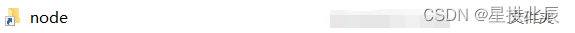
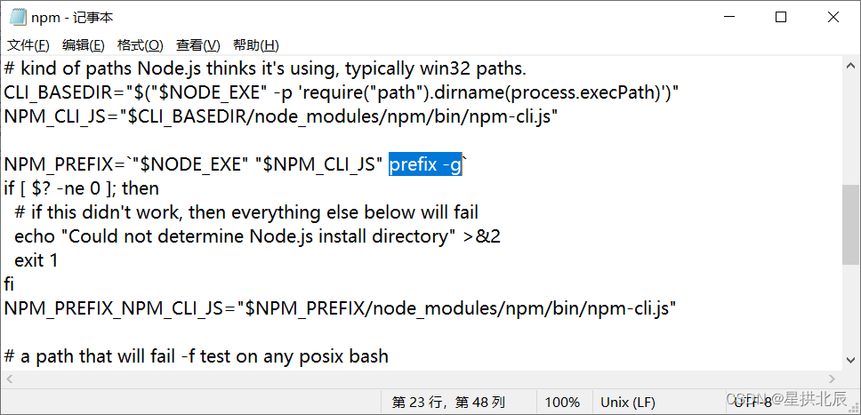
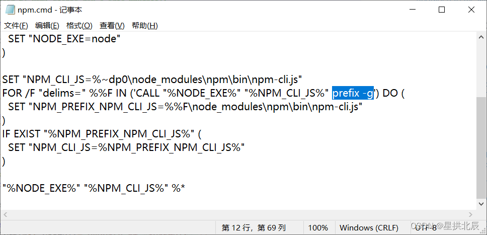

---
title: NVM和Node.js开发环境搭建
date: 2022-08-25 23:49:56
summary: 本文介绍如何在Windows和Linux环境下安装配置NVM和Node.js。
tags:
- Web前端技术
- NVM
- Node.js
- JavaScript
categories:
- 开发技术
---

# NVM

NVM的全称是Node Version Manager，[GitHub](https://github.com/coreybutler/nvm-windows)开源了其Windows实现，下载版本可以[自选](https://github.com/coreybutler/nvm-windows/tags)。



选择`nvm-setup.exe`或`nvm-setup.zip`即可，双击exe文件安装，其中nvm安装根路径可以自选，自行安装即可，并不复杂。

安装后，系统环境变量会多出来两个：



PATH也会多两个值：



NVM_HOME存储的是NVM的根路径，NVM_SYMLINK存储的是到当前使用的Node.js的符号链接路径。

由于PATH已经自动添加了`%NVM_HOME%`，所以可以直接使用`nvm`命令。

首先查看NVM版本：
```shell
nvm version
```
注意：网上的资料普遍说应该使用`nvm -v`，其实博主安装的时候命令已经不是这样的了。

可以查看NVM支持的可选Node版本：
```shell
nvm list available
```

基于NVM安装Node有三种方式：
1. 安装最新版本：`nvm install node`
2. 安装最新LTS版本：`nvm install --lts`
3. 安装指定版本：`nvm install <version>`

当然，自行去[官网](https://registry.npmmirror.com/binary.html?path=node)查找合适的Node版本也可以。

下载Node可能是缓慢的，为此配置镜像即可。
打开NVM根路径下的settings.txt文件，末尾追加两行文本：
```text
node_mirror: https://npmmirror.com/mirrors/node/
npm_mirror: https://npmmirror.com/mirrors/npm/
```
保存后下载Node速度飞快！
安装后的`NVM_HOME`目录结构是：


安装好Node后并不能够使用`node`命令和`npm`命令，因为还没有选择NVM当前的Node版本：
```shell
nvm use <version>
```
这里的坑是，`nvm install`后，命令行输出最后一行显示了`nvm use`，可能会让用户误以为默认执行了`nvm use`，其实不是，必须手动执行`nvm use`。

`nvm use`可能报错<font color="red">exit status 1: ��û���㹻��Ȩ��ִ�д˲�����</font>，管理员身份运行即可解决问题。

执行`nvm use`后，`NVM_SYMLINK`路径对应的文件夹是这样的：


执行`nvm use`后，可以直接调用`node`命令和`npm`命令：
```shell
node -v
npm -v
```

NVM支持列出已安装的可选Node版本：
```shell
nvm ls
```

NVM支持删除指定版本的Node：
```shell
nvm uninstall <version>
```

# Node.js

对于选中的Node，需要进行进一步配置。

首先执行：
```shell
npm install express -g
```

为了加快npm安装速度，可以配置npm镜像：
```shell
npm config set registry https://registry.npm.taobao.org
```

配置镜像后可以查看镜像：
```shell
npm config get registry
```

cnpm也是可以安装配置的，但是由于其存在一定的问题，博主没有安装cnpm。

配置当前Node的全局安装路径和全局缓存路径：
```shell
npm config set prefix "<NVM_HOME>\v16.16.0\node_global"  //配置全局安装路径
npm config set cache "<NVM_HOME>\v16.16.0\node_cache"    //配置全局缓存路径
```

可能会报错：
<font color="red">npm WARN config global \`--global\`, \`--local\` are deprecated. Use \`--location=global\` instead"</font>

参考[StackOverflow](https://stackoverflow.com/questions/72401421/message-npm-warn-config-global-global-local-are-deprecated-use-loc)，正确的解决方法是修改Node根目录下的`npm`文件23行和`npm.cmd`文件12行：





将这两处`prefix -g`换成`prefix --location=global`即可。升级到`16.17.0`也可以解决此问题。

npm可能会报<font color="red">ERR! Unexpected token '.' </font>错误，这是nvm`1.1.7`版本的问题，可以提升版本。

# Linux

补充一下Linux环境下载配置方法：

下载后vim打开`.bashrc`文件：
```shell
vim ~/.bashrc
```

末尾添加如下文本：

```shell
export NVM_DIR="/home/<username>/.nvm/nvm-0.39.0"
[ -s "$NVM_DIR/nvm.sh" ] && \. "$NVM_DIR/nvm.sh"  # This loads nvm
[ -s "$NVM_DIR/bash_completion" ] && \. "$NVM_DIR/bash_completion"  # This loads nvm bash_completion
```

激活`.bashrc`文件：
```shell
source ~/.bashrc
```
