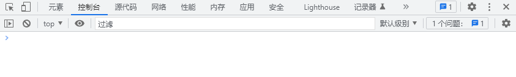

# 本文说明

学习和验证JavaScript等网页脚本时，如何运行和调试是一个重要的问题。本文以JavaScript为例，分享几种执行验证网页脚本的方法。

# 浏览器控制台交互

键盘按下`F12`，开启浏览器Console：


可以直接在浏览器控制台输入JavaScript语句进行交互：


# IDE启动Node.js执行

开启WebStrom，新建工程：


设置新工程基本属性：


接下来编写待运行的JavaScript脚本：


右键直接Run即可：


控制台查看输出结果：


# 嵌入HTML执行

推荐阅读：[网页脚本引入](https://blankspace.blog.csdn.net/article/details/129192846)

## 引入JavaScript的方法

JavaScript在HTML的引入方式共有5种：
- 页头直接引入（`<head>`标签内）
- 页中直接引入（`<body>`标签内）
- 页头和页中直接引入（`<head>`标签和`<body>`标签内同时引入）
- 元素事件中直接引入（标签属性中引入，例如`onclick`）
- 外部脚本文件引入（`src`属性中填写路径）

开发完成后，用浏览器打开HTML文件，键盘按下`F12`，开启浏览器Console，查看结果。

### 页头直接引入

当脚本被调用时，它们会被执行，或者某个事件被触发时，脚本也有可能会执行。
当我们把脚本放置于 head 部分时，就可以确保在用户使用之前它们已经被载入了。

```html
<!DOCTYPE html>
<html lang="zh">
  <head>
    <meta http-equiv="Content-Type" content="text/html; charset=utf-8"/>
    <script type="text/javascript">
      // some statements
    </script>
  </head>
  <body>
  </body>
</html>
```

### 页中直接引入

当页面的 body 部分被载入时，脚本就会被执行。
当我们把脚本放置于 body 部分，它会生成页面的内容。

```html
<!DOCTYPE html>
<html lang="zh">
  <head>
    <meta http-equiv="Content-Type" content="text/html; charset=utf-8"/>
  </head>
  <body>
    <script type="text/javascript">
      // some statements
    </script>
  </body>
</html>
```

### 页头和页中直接引入

可以同时在 body 和 head 部分放置脚本，理论上数量不限制。

```html
<!DOCTYPE html>
<html lang="zh">
  <head>
    <meta http-equiv="Content-Type" content="text/html; charset=utf-8"/>
    <script type="text/javascript">
      // some statements
    </script>
  </head>
  <body>
    <script type="text/javascript">
      // some statements
    </script>
  </body>
</html>
```

### 元素事件中直接引入

以`onclick`为例：
```html
<!DOCTYPE html>
<html lang="zh">
  <head>
    <meta http-equiv="Content-Type" content="text/html; charset=utf-8"/>
  </head>
  <body>
    <h1 onclick="this.innerHTML='已点击文本！'">请点击文本!</h1>
  </body>
</html>
```

### 外部脚本文件引入

外部脚本文件可能是本地的，也可能是需要远程加载的。前者可以用本地的绝对路径或相对路径，后者可以直接填写URL。

以下面的文件目录结构为例：
- 📁root
    - 📁css
        - 🗄️style.css
    - 📁js
        - 🗄️main.js
    - 🗄️index.html

```html
<!DOCTYPE html>
<html lang="zh">
  <head>
    <meta http-equiv="Content-Type" content="text/html; charset=utf-8"/>
    <script type="text/javascript" src="https://apps.bdimg.com/libs/jquery/2.1.4/jquery.min.js"></script>
    <link rel="stylesheet" href="./css/style.css">
  </head>
  <body>
    <script type="text/javascript" src="./js/index.js"></script>
  </body>
</html>
```

## 显示JavaScript数据的方法

- 使用`window.alert()`弹出警告框。
- 使用`document.write()`方法将内容写到 HTML 文档中。
- 使用`innerHTML`写入到 HTML 元素。
- 使用`console.log()`写入到浏览器的控制台。
